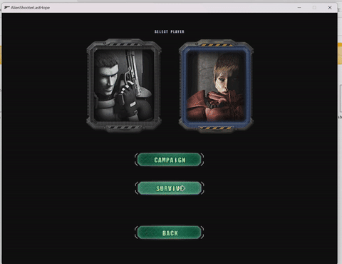
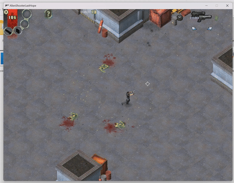
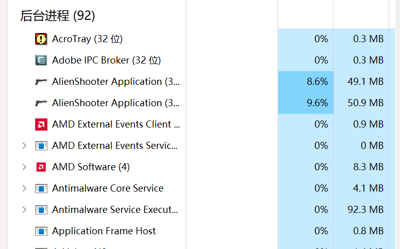
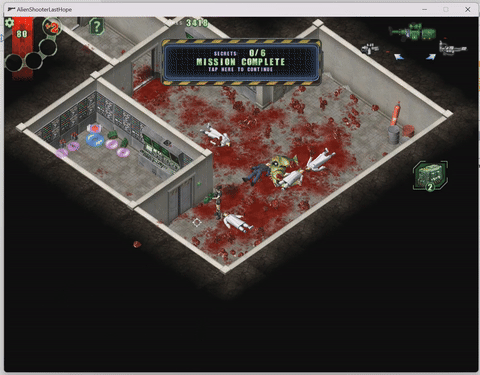
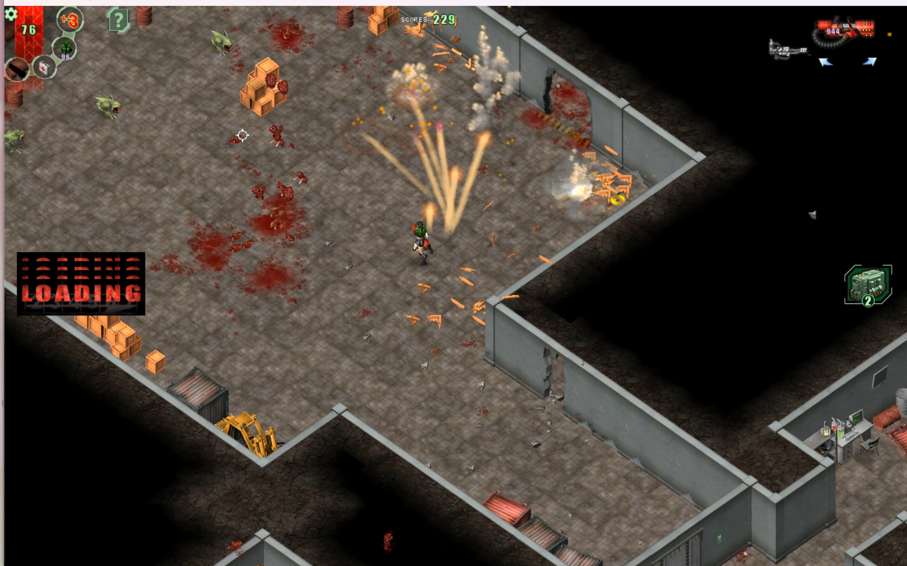

# LgdDecompiler V 0.1.0

🌍 **Language / 语言**

- [🇺🇸 English Version](# 🇺🇸 English Version)
- [🇨🇳 中文版](# 🇨🇳 中文版)

------

## 🇺🇸 English Version

### lgd Manual

If you are interested in learning more about lgd files, please visit

[lgd Manual MD](docs/lgd_doc_EN.md)

Or

[lgd Manual PDF](docs/lgd_doc_EN.pdf)

### How to Use

Simply drag and drop a directory containing `.lgd` files, or a single `.lgd` file, onto the corresponding `.bat` script.

You have the option to keep the intermediate files generated during the analysis process, or clear them to strictly output only the final `.LGC` files.

During execution, please ignore any yellow `[Warning]` logs. As long as there are no red `[Error]` logs, the decompiled scripts should be syntactically sound.

> **Note:** It is not recommended to use this tool on versions containing `default.lgd`. It will cause severe lag and will likely freeze the program.

### Project Structure

```bash
LgdDecompiler/
├── main.py                     # Program entry point
├── config.py                   # Global configuration
├── logger.py                   # Logging module
│
├── common/                     # LGD file definition modules
│   ├── binary_utils.py         # Utils: XOR decryption and string formatting
│   ├── definitions.py          # Part 1 & Part 2 table definitions
│   ├── opcodes.py              # VM opcode mapping and instruction definitions
│   └── structures.py           # Overall LGD structural blueprints
│
├── core/                       # Initial analysis and conversion modules
│   ├── analyzer.py             # Further analysis of wrapped objects
│   ├── context.py              # State management for the decompilation context
│   ├── parsers.py              # Parses raw data and wraps into objects
│   └── pipeline.py             # Main pipeline scheduler
│
├── generate_intermediate/      # Intermediate product generation
│   ├── lgd_decryptor.py        # Decrypts the raw .lgd binary file
│   ├── renderer_asm.py         # Converts bytecode into readable .asm for analysis
│   ├── renderer_c.py           # Experimental analyzer for P1 & P2 (for manual review)
│   └── exporter_csv.py         # Exports string/extern tables to CSV format
│
├── generate_LGC/               # Core LGC code generator
│   ├── asm_parser.py           # ASM Parser: Reads .asm and converts to structured objects
│   ├── asm_structs.py          # Data structures for assembly instructions and methods
│   ├── cfg_builder.py          # CFG Builder: Splits Basic Blocks and jump edges
│   ├── cfg_structs.py          # Data structures for CFG basic blocks
│   ├── ast_builder.py          # AST Builder: Derives expressions via symbolic execution
│   ├── ast_structs.py          # AST Nodes (Variables, constants, binary ops, etc.)
│   ├── flow_structurer.py      # Flow Structurer: Identifies If/While/For via graph theory
│   ├── lgc_context.py          # LGC specific context (local variables, type inference)
│   ├── lgc_header_manager.py   # Header Manager: Handles globals, externs, and arrays
│   ├── lgc_optimizer.py        # Optimizer: Simplifies AST structures and redundant expressions
│   └── lgc_generator.py        # Code Generator: Traverses AST to output final scripts
│
├── LGC_refiner/                # Post-processing code optimizer (Planned)
│   └── lgc_refiner.py          
│
└── test/                       # Test suites
```

### Known Bugs

Since this is an early v0.1.0 release, there are quite a few bugs. Currently, the decompiler barely reaches the point where the script can compile and load into the game.

#### 1. Survival Mode Inevitable Crash

- **Scenario 1:** Crashes immediately upon clicking the start button.



- **Scenario 2:** Enters the game, but crashes immediately upon pressing ESC.



- **Scenario 3:** Enters the game, successfully returns to the menu via ESC, but crashes shortly after.


> **⚠️ Note:** After the crash, the program process will hang in the background and must be terminated manually via Task Manager.
>
> 

#### 2. Crash After Mission Completion

This is a random event, possibly related to runtime duration or whether screen recording is active. It might crash immediately after clicking the clear-stage button, shortly after entering the next level, or after powering up and returning to the main menu. The first scenario is the most frequent.



**Crash Logs:**

```bash
# Crash immediately after clicking the button
[E] 16:10:01.399 - [thread_2] Unexpected action: 120,  nVid = 0 in 'int __thiscall SPRITE::Action(int,int,int,int)' <H:\repository\sources\sprite.cpp> at 2872
[E] 16:10:01.470 - [thread_2] SCRIPT Can't find variable "Action589943" in 'int __thiscall SCRIPT::GetVariableActionInt(unsigned int)' <H:\repository\sources\script.cpp> at 318
[E] 16:10:01.470 - [thread_2] SCRIPT Can't find variable "Action589943" for SetVariableActionInt in 'void __thiscall SCRIPT::SetVariableActionInt(unsigned int,int)' <H:\repository\sources\script.cpp> at 334
[E] 16:10:01.470 - [thread_2] Reference count non zero after delete -1,  nvid = 504 in '__thiscall SPRITE::~SPRITE(void)' <H:\repository\sources\sprite.cpp> at 463

# Crash after entering the next level
[I] 17:02:35.155 - [thread_2] Start to load map "maps\shop.map"
...
[E] 17:02:35.161 - [thread_2] Can't load menu ini: maps\shop.ini in 'void __thiscall MENU::fillMorphingList(const class STRING &)' <H:\repository\sources\menu.cpp> at 456
```

#### 3. Monster Indicator Arrow Logic Error

The arrow cannot point to monsters dynamically. It currently spawns fixed on the ground and disappears only after all monsters are cleared. *Fix priority:* Moderate. Should be patchable by porting the logic from the *Lost City* version.

#### 4. Lingering "Loading" Text on Maps

A "Loading" string occasionally gets stuck at fixed coordinates on the map. Suspected to be present in every level (confirmed on the first two levels).



------

## 🇨🇳 中文版

### lgd文档

如果你有兴趣了解更多有关lgd文件的信息,请访问

[lgd说明手册 MD](docs/lgd_doc_CN.md)

或

[lgd说明手册 PDF](docs/lgd_doc_CN.pdf)


### 如何使用

将含有 `.lgd` 的文件夹路径或单个 `.lgd` 文件直接拖拽到对应的 `.bat` 脚本上即可执行。

你可以选择保留分析过程中的中间产物，或者清除它们只保留最终生成的 `.LGC` 源码文件。

在运行过程中出现的黄色 `[警告]` 日志可以忽略，只要不出现红色的 `[报错]`，生成的脚本在语法上至少是完整的。

> **注意：** 极不建议用于处理包含 `default.lgd` 的版本，这会导致极其严重的卡顿甚至程序卡死。

### 项目结构

```bash
LgdDecompiler/
├── main.py                     # 程序入口点
├── config.py                   # 全局配置
├── logger.py                   # 日志模块
│
├── common/                     # lgd文件定义模块
│   ├── binary_utils.py         # 辅助工具：XOR解密算法和格式化字符串
│   ├── definitions.py          # LGD P1与P2表格中的基础定义
│   ├── opcodes.py              # 虚拟机操作码映射表与指令定义
│   └── structures.py           # LGD 总体结构蓝图
│
├── core/                       # 初步分析与转化模块
│   ├── analyzer.py             # 对封装对象进行进一步分析
│   ├── context.py              # 反编译对象上下文状态管理
│   ├── parsers.py              # 解析二进制并封装为对象
│   └── pipeline.py             # 总体任务调度
│
├── generate_intermediate/      # 中间产物生成
│   ├── lgd_decryptor.py        # 解密原始的 .lgd 二进制文件
│   ├── renderer_asm.py         # 将字节码转换为可读的 .asm 汇编代码，供后续分析使用
│   ├── renderer_c.py           # 对P1、P2的实验性早期分析版本，用于人工走读校验
│   └── exporter_csv.py         # 将字符串表、外部函数表等导出为 CSV
│
├── generate_LGC/               # LGC源码生成器核心
│   ├── asm_parser.py           # 汇编解析器：读取 .asm 文本并转换回结构化对象
│   ├── asm_structs.py          # 定义汇编指令和方法的数据结构
│   ├── cfg_builder.py          # 控制流图 (CFG) 构建器：切分基本块与跳转边
│   ├── cfg_structs.py          # 定义 CFG 基本块的数据结构
│   ├── ast_builder.py          # 抽象语法树 (AST) 构建器：通过符号执行推导表达式与堆栈状态
│   ├── ast_structs.py          # 定义 AST 节点 (变量、常量、二元运算、函数调用等)
│   ├── flow_structurer.py      # 控制流结构化器：利用图论和支配树识别还原 If/While/For 结构
│   ├── lgc_context.py          # LGC 代码生成的特定上下文（局部变量名、类型推导等）
│   ├── lgc_header_manager.py   # 头部管理器：处理全局变量、外部引用 (Externs) 和数组声明
│   ├── lgc_optimizer.py        # LGC 代码优化器：优化 AST 结构，简化冗余表达式
│   └── lgc_generator.py        # LGC 代码生成器：遍历结构化的 AST 树，输出最终脚本代码
│
├── LGC_refiner/                # 代码后期优化模块（开发中）
│   └── lgc_refiner.py          
│
└── test/                       # 测试套件
```

### 已知 BUG

由于目前还是早期 0.1.0 版本，Bug 还比较多，目前仅能堪堪做到编译通过并且能挂载进游戏的地步。

#### 1. 生存模式必定闪退

- **情况 1：** 点击按钮后立刻崩溃。


- **情况 2：** 进入游戏后，点击 ESC 立刻崩溃。


- **情况 3：** 进入后点击 ESC 成功返回菜单，但停留一段时间后闪退。


> **⚠️ 注意：** 闪退后程序会在后台幽灵挂载，需要打开任务管理器手动终止。
>
> 

#### 2. 点击完成任务后闪退

这是一个概率事件，可能和游戏运行时长有关，也有可能和是否开启了录屏有关。 有可能在点击通关按钮时立刻闪退，也可能在进入下一关一段时间后闪退，或者在升级加点后点击 main menu 时闪退。其中第一种情况发生概率最高。


**崩溃日志参考：**

```bash
# 点击按钮后立刻报错
[E] 16:10:01.399 - [thread_2] Unexpected action: 120,  nVid = 0 in 'int __thiscall SPRITE::Action(int,int,int,int)' <H:\repository\sources\sprite.cpp> at 2872
[E] 16:10:01.470 - [thread_2] SCRIPT Can't find variable "Action589943" in 'int __thiscall SCRIPT::GetVariableActionInt(unsigned int)' <H:\repository\sources\script.cpp> at 318
[E] 16:10:01.470 - [thread_2] SCRIPT Can't find variable "Action589943" for SetVariableActionInt in 'void __thiscall SCRIPT::SetVariableActionInt(unsigned int,int)' <H:\repository\sources\script.cpp> at 334
[E] 16:10:01.470 - [thread_2] Reference count non zero after delete -1,  nvid = 504 in '__thiscall SPRITE::~SPRITE(void)' <H:\repository\sources\sprite.cpp> at 463

# 进入下一关后报错
[I] 17:02:35.155 - [thread_2] Start to load map "maps\shop.map"
...
[E] 17:02:35.161 - [thread_2] Can't load menu ini: maps\shop.ini in 'void __thiscall MENU::fillMorphingList(const class STRING &)' <H:\repository\sources\menu.cpp> at 456
```

#### 3. 指向怪物的箭头逻辑有误

目前的脚本无法动态指向怪物。它只会在地上创建一个固定的箭头，并在全部杀完怪后才消失。 *修复思路：* 难度不大，后续可以从 *Lost City* 版本的源码中抄一份逻辑过来打补丁。

#### 4. 地图上会残留 Loading 字样

疑似被硬编码打在了某个地图的固定坐标上，可能会在每一个地图中都有出现（只仔细验证了前两关的地图，均存在此问题，后续关卡待确认）。

