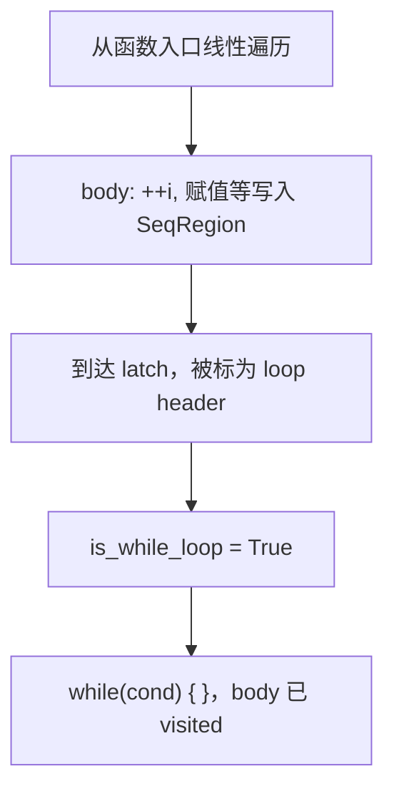

# do-while 反编译结构化问题说明与整改建议

> 关联文档：`endless_loop_test.md`（用例对照）、`验证endless_loop.md`（检测脚本）  
> 关联代码：`src/lgd_tool/lgd_decompiler/generate_LGC/flow_structurer.py`  
> 历史修复：`flow_structurer.bak` ≈ commit `d207d36`（`fix endless loop and assignment parens`）

---

## 1. 问题概述

反编译器在将 LGD 控制流图（CFG）恢复为 LGC 时，对部分 **`do { ... } while (cond)`** 生成错误结构，表现为：

| 症状 | 扫描器标记 | 运行时风险 |
|------|------------|------------|
| `while (cond) { }` 空循环体，关键语句在循环外只执行一次 | `[ERROR] empty_while` | **高**：`++i` 不递增 → 真死循环 |
| `while (1) { ... }` 无 `break` / 条件永不假 | `[WARNING] while(1)` | 视 body 而定 |
| `while (cond);` 或 `while (cond) { }` 且副作用仅在条件中 | 常被误报 `[ERROR]` | **低**：语义可能仍正确 |

已知游戏级影响（v0.3.0 部分修复）：

- 生存模式卡死（`SurviveGameTact` 出生点随机循环）
- 指向怪物箭头异常（同方法内逻辑）

仍未覆盖的典型案例：`createEnemyInPosition`、`moveEnemyToPosition`、`createMissionIcon` 等（见 `endless_loop_test.md` § 并未修复）。

---

## 2. 根因（机制层）

### 2.1 判定不读源码条件文本

`FlowStructurer._build_region` 用 **CFG 拓扑** 区分 while / do-while，**不解析**条件里是否有 `&&`：

```python
exit_from_header = [s for s in curr.successors if s.id not in loop_info.body_blocks]
is_while_loop = len(exit_from_header) > 0
```

| 分支 | 含义 | 多块循环常见结果 |
|------|------|------------------|
| `not is_while_loop` | 循环头**无** successor 跳出循环体 | `while(1) { 整圈 body }` + `break`（v0.3.0 修好的路径） |
| `is_while_loop` | 循环头**有** successor 跳出循环体 | `BlockRegion(header)` + `while(cond) { body }` |

### 2.2 未修案例的致命顺序（路径 B）

当 **loop header = 底部 latch（条件块）** 且该块有一条边指向循环外时：



结果：`++i` / `attempt++` 只执行一次；若首次仍满足 `cond`，则 **空 while 真死循环**。

### 2.3 与「复合条件 &&」的关系

- **不是**判定逻辑因 `&&` 走特殊分支。
- **是**「带计数上限的 do-while」在编译后常为 **latch 双分支**（回 body / 出循环），易使 `is_while_loop = True`。
- 反例：`SurviveGameTact` 仅 `while (CanPlace(...))` 无 `&&`，但因 CFG 走路径 A 已修复。

### 2.4 v0.3.0 已修内容（`d207d36` / `flow_structurer.bak`）

| 改动 | 作用 |
|------|------|
| 用 `exit_from_header` 替代 `len(body_blocks)==1` | 不再把「多块」一律当 while |
| `not is_while_loop` 且多块 → `LoopRegion(..., "1")` | 从循环头一次性重建整圈 body |
| 收集 `loop_exits` → `active_loop_exits` | 支撑 `break` |
| if 分支 / JMP 目标为循环出口 → `BreakRegion` | `if (!CanPlace) break` 等 |
| `is_first_block` 豁免 `stop_blocks` | 避免循环头被挡掉 |

**未改动的部分**：`is_while_loop == True` 时仍先线性输出 body，再建空 `while(cond)`。

### 2.5 误报类（非 do-while 结构化 bug）

```c
while (changeLoadingElementTag(...))
    ;
```

反编译为 `while (...) { }` 在 C/LGC 语义下 **每次迭代重新求值条件**，通常正确。`scan_while_issues.py` 的 `empty_while` 对此类应降级或白名单。

---

## 3. 用例分类

### 3.1 已修复（路径 A）

**`SurviveGameTact`** — 多块 body + 单条件 `CanPlace`：

```c
// 源码
do { x = Random(3); if/else ...; } while (CanPlace(...));

// 反编译（可接受）
while (1) {
    ...
    if (!CanPlace(...)) break;
}
```

### 3.2 未修复（路径 B，真 bug）

| 函数 | 源码特征 | 反编译典型错误 |
|------|----------|----------------|
| `createEnemyInPosition` | `++i` + `CanPlace && i < N` | body 一次 + 空 `while` |
| `moveEnemyToPosition` | 同上 | 同上 |
| `createMissionIcon` | `attempt++` + `!good && attempt < max` | 同上 |

### 3.3 扫描误报（路径无关）

`setMarketIndexedParameter`、`setBlackMarketIndexedParameter`、`slider_black_market_parameters` 等：`while (side_effect()) { }`。

---

## 4. 整改建议

### 4.1 推荐方案（优先）：识别 do-while latch，强制 `DoWhileRegion`

**目标**：无论 `is_while_loop` 真假，只要 CFG 形态是「先 body、后条件、回边到 body 入口」，都输出：

```c
do {
    ...
} while (cond);
```

**实现要点**（`flow_structurer.py`）：

1. **背边分析**：对 `is_while_loop == True` 的循环，检查 back edge 是否来自「仅含条件/分支」的 latch，且 body 入口在 header 之前已被遍历或可从 header 前驱到达。
2. **禁止先吐 body 再套 while**：若判定为 do-while，在 **首次遇到 body 入口或统一在 latch 处理时**，用 `stop_blocks` / `processed_loops` 阻止 body 块作为普通 `BlockRegion` 线性落入 `SeqRegion`。
3. **统一出口**：latch 上提取 `cond_str`（可含 `&&`，由 `_extract_condition` 负责），body 用 `_build_region(body_entry, loop_stops, ...)` 一次建完。
4. **单块退化**：`len(body_blocks) == 1` 保持现有 `DoWhileRegion`。

**优点**：与源码形态一致，不依赖 `while(1)+break` 启发式。  
**风险**：需处理 latch 与 body 块划分不一致的编译变体；建议用 `endless_loop_test.md` 用例加单元测试。

### 4.2 备选方案：扩展路径 A（`while(1)` + break）

对路径 B 的循环，若可证明 body 入口 dominate latch 前驱链，可降级为 `not is_while_loop` 处理：

```c
while (1) {
    ++i;
    ...
    if (!(CanPlace(...) && (i < N))) break;
}
```

**优点**：改动面小于完整 do-while 识别。  
**缺点**：生成代码与源码风格差；条件复杂时 `_extract_condition` 取反需验证。

### 4.3 扫描器调整（`scan_while_issues.py`）

| 规则 | 建议 |
|------|------|
| `empty_while` | 若 `while (` 行内匹配函数调用（如 `\w+\s*\(`），降为 WARNING 或忽略 |
| `while(1)` | 若 body 内含 `break`，不报或降为 INFO |
| 报告 | 增加 `likely_do_while_misclassified` 标签，区分真 bug 与误报 |

### 4.4 测试与回归

1. **单元测试**：`tests/unit/lgd_decompiler/generate_LGC/test_flow_structurer_do_while.py`（见 `TEST_PLAN_LGC_REGRESSION.md` §9）  
   - 覆盖：单块 do-while、多块 + latch header、复合条件、SurviveGameTact / createEnemy 最小 CFG fixture。
2. **金样 LGC**：从 `regression_loop_*.lgd` 导出，对比 `regression_lgc/regression_loop_*.lgc`。
3. **静态扫描 CI**：对 `main.lgc` 跑 `scan_while_issues.py`，`empty_while` 非白名单则失败。
4. **运行时**：`inject_log_per_method.py` + `split_loop_log.py` 确认问题方法调用频率正常。

### 4.5 实施顺序建议

```text
P0  路径 B 强制 DoWhileRegion（修 createEnemy / createMissionIcon）
P1  scan_while_issues 白名单（减 changeLoadingElementTag 误报）
P2  regression_loop_* fixture + CI
P3  文档与 endless_loop_test.md 同步更新「已修复」章节
```

---

## 5. 验收标准

修复完成后，对 `endless_loop_test.md` 中 **§ 并未修复** 的 1–3 应满足：

- [ ] 生成 `do { ... } while (...)` 或语义等价的 `while(1){...; if(!cond) break;}`，且 **`++i` / `attempt++` 位于每轮必达路径**。
- [ ] 不存在「循环外执行一次 body + 空 `while(cond)`」。
- [ ] `scan_while_issues` 对该方法无 `[ERROR] empty_while`（除非明确标注为已知误报）。

§ 4–7 的 `while(changeLoadingElementTag(...))` 可维持现状或仅调整扫描级别，**不作为** do-while 结构化修复的阻塞项。

---

## 6. 参考

| 资源 | 说明 |
|------|------|
| `git show d207d36 -- generate_LGC/flow_structurer.py` | v0.3.0 do-while 修复 diff |
| `flow_structurer.bak` | 修复后快照（循环逻辑与 d207d36 一致） |
| `endless_loop_test.md` | 源码/反编译对照 |
| `验证endless_loop.md` | Log 注入与扫描命令 |

---

*文档版本：与 2026-03 对话结论一致；实现状态以仓库 `flow_structurer.py` 为准。*
