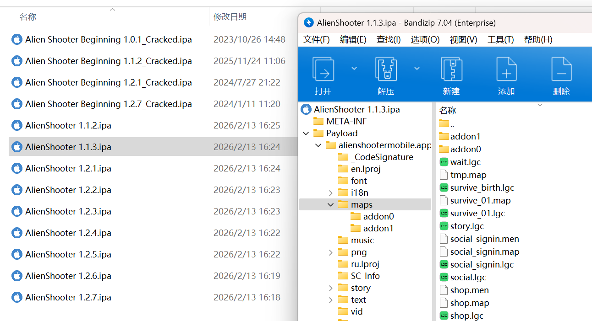
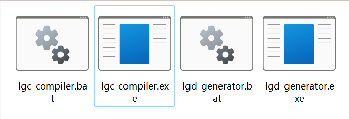
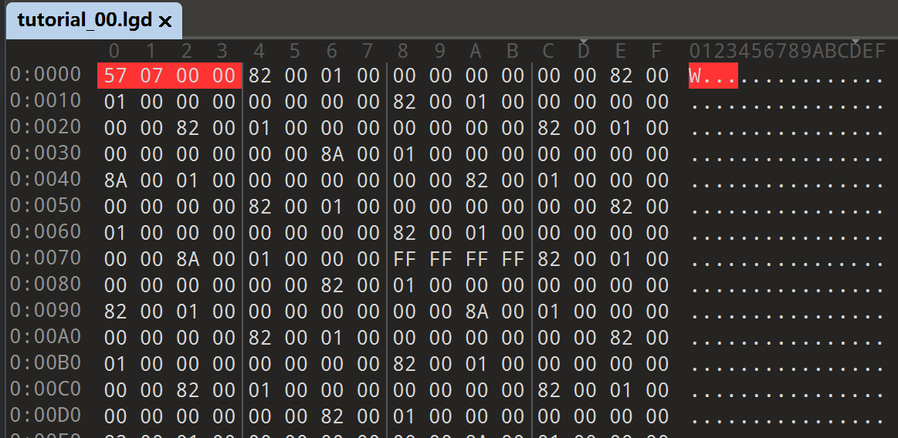
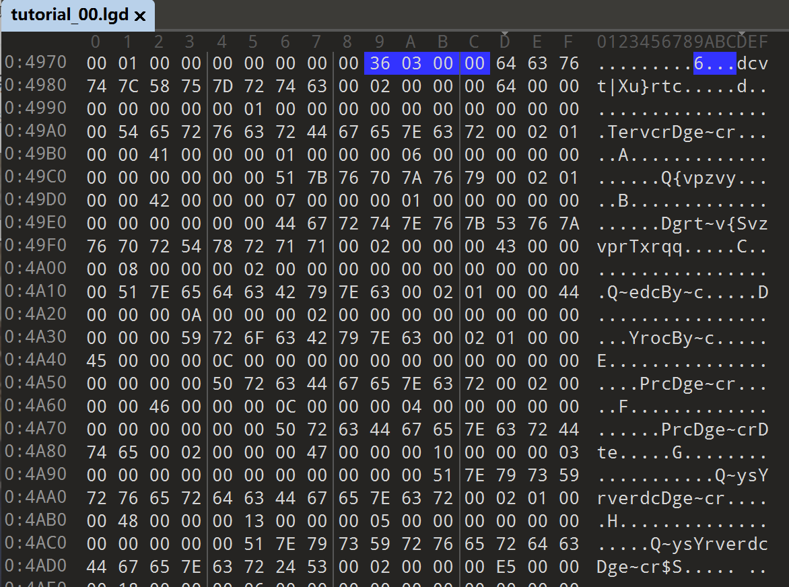
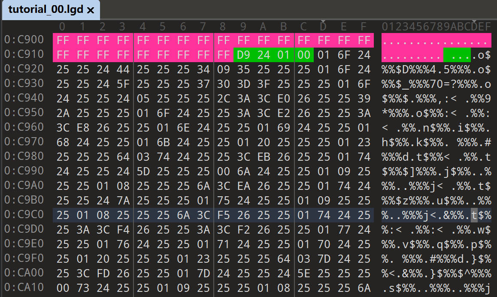

# LGD 文件文档

## 概述

LGD 编译器是一个离线静态编译器 + 静态链接器。

可以把LGD 和 LGC 的关系 类比为 java文件和经过 jvm 编译后的 class文件 

最初为早期手游平台设计。目的是将可读的类C脚本（`.lgc`）预编译为机器可执行的二进制字节码（`.lgd`），以换取更快的加载速度和更低的 CPU 开销。加密只是顺手做的副产物罢了

假设关卡脚本 `Level01.lgc` 引用了 `common.lgc` 等 10 个外部脚本。在未编译的情况下，引擎在加载该关卡时需要同时发起 10 次文件 I/O 操作进行读取和解析，效率极低；而在改用 LGD 编译器后，所有依赖均被打包链接成一个独立的 `.lgd` 文件，引擎只需处理单次 I/O 即可完成加载，大幅提升了运行效率。

其编译方式主要包括三个部分：

*   **预处理（Preprocessing）：** 递归处理源码中的 `#include` 指令。它会将所有引用的公用脚本（如 `items.lgc`, `common.lgc`）像链接 C 代码一样，“揉”进一个最终的二进制流中。
*   **语法校验：** 具备完整的 语法校验 功能, 如果有错那会直接报错
*   **地图绑定机制：** 编译过程以 `.map` 文件为索引。采用“一地图、一脚本包”的策略。

>[!NOTE]
>
>最后一个使用 lgc 的版本是 Alien Shooter The Beginning 1.1.3 IOS VER, 2013年11月22日发布
>
>

## 版本及用法说明

目前我们手上有两个版本的编译器 （这就不得不感谢sigma了，时不时送你一些开发者工具），方便起见就叫他们新版和旧版。本文主要分析都基于新版制作

+ 旧版 lgd_generator.exe 编译时间 2013-12-14 14:39:05
+ 新版 lgc_compiler.exe 编译时间 2017-10-31 08:36:40



在运行方式上没有本质上差别，新版多了不少奇怪的功能，不过大概率用不到他们

**旧版参数**

| **参数**     | **说明**                                            |
| ------------ | --------------------------------------------------- |
| `all`        | 编译当前目录及所有子目录下的全部 lgc 文件并生成 lgd |
| `[filename]` | 仅针对指定的单个 lgc 文件生成 lgd                   |

**新版参数**

| **参数**            | **格式**                     | **逻辑说明**                                                 |
| ------------------- | ---------------------------- | ------------------------------------------------------------ |
| **1. 源码目录**     | `--source-dir=DIR`           | 指定搜索 `.lgc` 文件的根路径，若不设置则默认为当前目录。     |
| **2. 目标目录**     | `--target-dir=DIR`           | 指定生成的 `.lgd` 文件存放位置，会保留原始目录结构。         |
| **3. 宏定义**       | `-D<DEFINE>`                 | 设置预处理器宏（如 `-DPLATFORM_WIN=1`），用于脚本内部的条件编译。 |
| **4. 包含路径**     | `-I<PATH>`                   | 增加 `#include` 搜索路径，支持多个路径叠加。                 |
| **5. 冗长输出**     | `-v` 或 `--verbose`          | 开启详细日志模式，显示编译过程中的符号处理细节。             |
| **6. 基础扩展信息** | `--base-expansion-info PATH` | 补丁? 指向现有的扩展信息文件，若不存在则会尝试创建。         |
| **7. 扩展文件**     | `--expansion-file=PATH`      | 补丁? 指定扩展/补丁文件的路径，触发 Checksum 计算逻辑。      |
| **8. 版本号**       | `--version=VERSION`          | 为补丁指定一个版本字符串，存入 `EXPANSION_VERSION`。         |
| **9. 错误处理**     | `--stop-on-error`            | 遇到第一个编译错误时立即停止，不再处理后续文件。             |
| **10. 目标文件**    | `FILES`                      | (位置参数) 指定一个或多个要编译的特定 `.lgc` 文件。          |

还有一点，旧版在使用include时必须加上map/路径

``` c++
#include "maps\export.lgc"
#include "maps\common.lgc"
#include "maps\common_compaign.lgc"
```

而新版必须不加maps/路径

``` c++
#include "core\export.lgc"
#include "common.lgc"
#include "common_campaign.lgc"
```

## 文件格式

分析之前先随便打开一个文件看看其格式，方便后续分析

可以看到:

第一部分，十分稀疏，基本都是 空文字



第二部分，比较稀疏，可以看到些许乱码字符



第三部分，FF填充 （其实严格意义上说这里有两部分）


第四部分，稠密，可以看到很多 % 和其他乱七八糟的字节



## 第一部分：字面值表 (Literal Table)

主要负责记录所有变量 -- **(全局变量、函数参数、局部变量 )的状态以及它们的初始值**。

**固定头 4 位为 index count**

> [!TIP]
>
> 1. 引擎底层实际上仅支持 `int`、`string` 以及它们对应的数组。
> 2. 虽然引擎在底层标志位上预留了对“指针”操作的支持，但官方脚本中从未实际使用过。
> 3. `static` 和非 `static` 的**全局变量**在编译后的文件中没有任何区别，这两个关键字的差异仅在作为**局部变量**时才会体现。

### 1. 核心概念：Index 与 Global ID 的区别

为了看懂字面值表，必须先理清 `Index` (条目索引) 和 `Global ID` (全局/逻辑 ID) 的区别。这也是整个表中最容易混淆的地方：

- **Index (条目索引)：** 代表物理存储的“坑位”。一个基本变量占 1 个 Index；一个长度为 $N$ 的数组，其每一个元素都会占据 1 个独立的 Index。文件开头的 `Entry Count` 指的就是 Index 的总数。
- **Global ID (逻辑组 ID)：** 代表逻辑上的“归属”。它是按组分配的：
    - 一个普通变量独占 1 个 ID。
    - **一整个数组，无论有多少个元素，都共享同一个 ID。**
    - **一个函数及其内部的所有参数、局部变量，也全部共享同一个 ID。**

**👇 实验对照：数组的 Index 与 ID 分配**

我们以一个包含 3 个元素的 `int` 数组为例：

```c++
int intArray[3] = { 114, 514, 19198 };
```

在字面值表中，它被拆分成了 3 个 Index 条目，但它们共享同一个 ID（例如 ID为 `9`）。请注意观察数组首项与后续项的区别：

```c++
// [GlobalID: 9] 占用了 3 个 Index 条目
// Flag | 字符串(空) | Size 或 ID          | Value
   8E     00          03 00 00 00 /* Size: 3 */    72 00 00 00 /* Val: 114 */
   8E     00          09 00 00 00 /* ID: 9   */    02 02 00 00 /* Val: 514 */
   8E     00          09 00 00 00 /* ID: 9   */    FE 4A 00 00 /* Val: 19198 */
```

*注：数组的首个条目记录的是数组的长度 (Size: 3)，而后续条目在同样的位置记录的则是它们归属的 ID (ID: 9)。*

------

### 2. 数据条目结构与 Flag 标志位

通过上述分析，我们可以总结出每个 Index 条目的标准内存结构如下：

| **偏移 (Byte)** | **字段名**         | **长度**    | **解析说明**                                                 |
| --------------- | ------------------ | ----------- | ------------------------------------------------------------ |
| `0`             | **Flag**           | 1 byte      | 变量的状态/类型标志位（详见下方表格）。                      |
| `1` ~ `n+1`     | **String Content** | n + 1 bytes | 变量名或字符串内容，以 `00` 结尾。如果无字符串则仅为一个 `00`。 *(注：内容经过 XOR 17 加密)* |
| `n+2` ~ `n+5`   | **ID / Size**      | 4 bytes     | **核心区分位**：如果是独立变量或数组首项，这里记录的是 **Size**；如果是数组的后续元素，这里记录的是 **ID**。 |
| `n+6` ~ `n+9`   | **Value**          | 4 bytes     | 有符号整数的初始值。如果是字符串类型，此处通常补零为 `00 00 00 00`。 |

**Flag 标志位 (Byte 0) 构成逻辑：**

Flag 的值实际上是由不同权重的属性按位或（OR）组合而成的：

| **权值 (Hex)** | **功能分类** | **含义说明**                             |
| -------------- | ------------ | ---------------------------------------- |
| `0x80`         | **基准位**   | Literal Entry (第一部分字面值的必须标识) |
| `0x01`         | **类型位**   | 属于 `String` (字符串)                   |
| `0x02`         | **类型位**   | 属于 `Int` (整数)                        |
| `0x04`         | **结构位**   | 属于 `Array` (数组 `[]`)                 |
| `0x08`         | **状态位**   | Initialized (已初始化并赋值)             |
| `0x20`         | **指针位**   | Pointer (指针 `*`，官方脚本未使用)       |

根据上述权值组合，反编译中常见的 Flag 常量如下：

- **基础未赋值：** `81` (未赋值 string), `82` (未赋值 int), `85` (未赋值 string[]), `86` (未赋值 int[])
- **基础已赋值：** `89` (已赋值 string), `8A` (已赋值 int), `8D` (已赋值 string[]), `8E` (已赋值 int[])
- **罕见指针类：** `A1` (string*), `A2` (int*), `A5` (string[]*), `A6` (int[]*)

------

### 3. 基础变量字节码解析

为了更直观地理解字面值表的结构，我们先抛开复杂的数组，来看看最基础的 `int` 和 `string` 变量在编译后长什么样。

#### 案例一：基础的 Int 变量

我们定义一个未赋值的 `unusedValue` 和一个赋值为 `166` 的 `gval`：

```c++
int unusedValue;
int gval = 166;
```

对应的字面值表十六进制数据如下：

```c++
// [GlobalID: 0] 变量: int unusedValue;
// Flag | Str | Size(4 bytes)       | Value(4 bytes)
   82     00    01 00 00 00 /* Size: 1 */    00 00 00 00 /* Val: 0 */

// [GlobalID: 1] 变量: int gval = 166;
// Flag | Str | Size(4 bytes)       | Value(4 bytes)
   8A     00    01 00 00 00 /* Size: 1 */    A6 00 00 00 /* Val: 166 (0xA6) */
```

**解析：**

- **Flag：** `82` 代表未赋值的 int；`8A` 代表已赋值的 int。
- **Str：** 因为是整数变量，这里没有字符串内容，直接用 `00` 占位并结束。
- **Size：** 这是一个单体变量，所以 Size 固定为 1（`01 00 00 00`）。
- **Value：** `unusedValue` 默认填 0；`gval` 的 166 转换为十六进制即为 `A6 00 00 00`。

#### 案例二：基础的 String 变量

字符串的处理方式与整数类似，但它的“值”是直接写入 `Str` 字段的（且经过了简单的异或加密），而尾部的 `Value` 字段会被强制置零。

```c++
string unusedTxt; 
string txt = "sample text";
```

对应的字面值表十六进制数据如下：

```c++
// [GlobalID: 4] 变量: string unusedTxt;
// Flag | Str | Size(4 bytes)       | Value(4 bytes)
   81     00    01 00 00 00 /* Size: 1 */    00 00 00 00 /* Val: 0 */

// [GlobalID: 5] 变量: string txt = "sample text";
// Flag | Str (加密后的字符串)                              | Size(4 bytes) | Value(4 bytes)
   89     64 76 7A 67 7B 72 37 63 72 6F 63 00 /* "sample text" */ 01 00 00 00 /* Size: 1 */ 00 00 00 00 /* Val: 0 */
```

**解析：**

- **Flag：** `81` 代表未赋值 string；`89` 代表已赋值 string。
- **Str：** 未赋值时仅为 `00`。赋值为 `"sample text"` 时，引擎将其经过 XOR 17 加密后存入（十六进制 `64 76...`），并在末尾补 `00` 作为字符串终止符。
- **Value：** 由于数据已经存在了前面的 `Str` 块中，后方的 Value 字段统一填充为 `00 00 00 00`。

---

### 4. 编译器的“特殊癖好”与实验验证

为了彻底摸清编译器的行为，我们通过脚本测试了宏定义和局部变量，发现了几个有趣的特性。

#### 特性一：常量的彻底抹除

表里找不到宏定义或常量？因为编译器在预处理阶段直接把它们“丢弃”并替换成了字面数值。

```c++
// 源码
#define USED_CONST 150
int constVal = USED_CONST;
```

```c++
// 编译后的字面值表：直接当作 int constVal = 150; 处理
// Flag | Str | Size                 | Value
   8A     00    01 00 00 00 /* Size: 1 */    96 00 00 00 /* Val: 150 */
```

#### 特性二：局部变量的 Static 差异化处理 (极其奇葩的初始化)

函数内部的局部变量对 `static` 的处理逻辑截然不同，尤其是数组。

**如果是 `static` 局部变量：** 它会在字面值表中直接保留初始化的值。

```c++
static int stval = 100;
static int starr[] = {0x2222, 0x3333, 0x4444, 0x5555};
```

```c++
// 正常保留了数值 (64 00 00 00 即 100，22 22 00 00 即 0x2222...)
   8A 00  01 00 00 00 /* Para 4 */   64 00 00 00 /* Val: 100 */
   8E 00  04 00 00 00 /* Para 5 */   22 22 00 00 /* Val: 8738 (0x2222) */
   // ...后续数组元素正常带值
```

**如果是非 `static` 局部变量：** 编译器会将其强行降级为**未初始化变量**，其初始值在字面值表中全部填 `0`。实际的赋值操作被编译器推迟到了后期的 Bytecode (字节码) 执行阶段！

```c++
int val = 100;
int arr[] = {0x2222, 0x3333, 0x4444, 0x5555};
```

```c++
// Flag 变成了 82(未赋值int) 和 86(未赋值int数组)，值全部是 00 00 00 00！
   82 00  01 00 00 00 /* Para 9 */   00 00 00 00 /* Val: 0 */
   86 00  04 00 00 00 /* Para 10 */  00 00 00 00 /* Val: 0 */
   86 00  11 00 00 00 /* Para 11 */  00 00 00 00 /* Val: 0 */
   // ...全都是 0
```

#### 特性三：Extern 外部函数（引擎接口）的参数映射

`extern` 关键字用于声明引擎底层提供的内置函数。在字面值表中，`extern` 函数的表现与普通函数非常相似：它们同样会被分配一个独立的 **Global ID**。并且记录其参数

``` c++
extern MessageText(string text,int x,int y,int fontNvid = -1) 114;
```

``` c++
// Extern: MessageText (Extern ID: 114)
    81 00                       01 00 00 00 /* Size: 1 */    00 00 00 00 /* Val: 0 */
    82 00                       01 00 00 00 /* Size: 1 */    00 00 00 00 /* Val: 0 */
    82 00                       01 00 00 00 /* Size: 1 */    00 00 00 00 /* Val: 0 */
    8A 00                       01 00 00 00 /* Size: 1 */    FF FF FF FF /* Val: -1 */
```

## 第二部分：符号表 (Symbol Table) 结构解析

紧接着字面值表之后的是**符号表**。它的核心作用是将我们在源码中定义的“变量名”和“函数名”与第一部分分配的 `Global ID` 绑定起来，并记录它们的元数据（如入口偏移量、参数数量等）。

> **💡 引擎冷知识：局部变量去哪了？**
>
> 在符号表中，你会发现只有**全局变量**和**函数名**的存在。所有的函数参数名、局部变量名全部被编译器无情地丢弃了！在引擎底层的视角里，局部变量只是一堆没有名字的堆栈偏移量和在字面值表中占用的 `Index`。

### 1. 符号表整体结构

符号表以一个 4 byte 的总数（Entry Count）开头，指示表内共有多少个 Global ID 条目。

紧接着是顺序排列的条目数据。每个条目由 **动态长度的字符串** + **固定 24 byte 的属性块** 组成：

- **符号名 (String)：** 经过 XOR 17 加密的字符串，以 `00` 结尾。
- **属性块 (24 bytes)：** 固定长度的二进制结构，具体定义如下表。

| **内部偏移 (Byte)** | **长度** | **字段名**              | **详细含义与处理逻辑**                                       |
| ------------------- | -------- | ----------------------- | ------------------------------------------------------------ |
| `+0`                | 2 bytes  | **Type**                | **符号类型与状态标志**。区分它是变量、普通函数还是 Extern 函数（详见下文状态表）。 |
| `+2`                | 2 bytes  | **Meta**                | **多路复用字段**。<br />但多数情况下没啥用                   |
| `+4`                | 4 bytes  | **Extern ID / Padding** | **外部函数标识**。 <br />● **Extern 函数 (`Type=02`)**: 记录其对应的内置 ID。 <br />● **其他情况**: 固定填充为 `00 00 00 00`。 |
| `+8`                | 4 bytes  | **P1_Idx**              | **字面值表索引 (Part 1 Index)**。 指向该符号在第一部分（字面值表）中对应初始值的起始位置。 |
| `+12`               | 4 bytes  | **Size**                | **大小 / 元素数**。 <br />● **变量**: 数组的长度（如 `int a` 为 1，`int a[3]` 为 3）。 <br />● **函数**: 参数列表的总长度（**注意：不包含局部变量**）。 |
| `+16`               | 4 bytes  | **File_ID**             | **源文件 ID**。`0` 代表主文件，`1, 2...` 代表按顺序 `#include` 的文件。（注：大部分函数的 File ID 并不准确，常全为 0；变量的排序逻辑暂不可考）。 |
| `+20`               | 4 bytes  | **Run_ID**              | **运行时 ID (Runtime ID)**。具体作用未知，乱序               |

------

### 2. Type 标志位与“返回值追踪”机制

符号表 `+0` 偏移处的 `Type` 字段不仅仅是用来区分变量和函数的，它还隐藏了一个极其精妙的机制：**编译器会静态分析函数的返回值是否在上下文中被实际使用，并将其记录在 Type 中。**

**Type 标志位枚举大全：**

- **`01 00`** : 全局变量 (Variable)
- **`02 00`** : 外部函数 (Extern)，且返回值**未被使用**
- **`02 01`** : 外部函数 (Extern)，且返回值**被使用**
- **`03 00`** : 普通函数 (Function)，无返回值 (Void)
- **`03 01`** : 普通函数 (Function)，有返回值，且被 `await` 关键字使用
- **`03 02`** : 普通函数 (Function)，有返回值，但**未被使用**
- **`03 03`** : 普通函数 (Function)，有返回值，且**被使用**

**👇 实验对照：Extern 返回值追踪**

以 `CreateSprite` 这个 extern 函数为例，调用方式的不同会直接改变其在符号表中的 `Type` 签名：

```c++
// 场景 A：仅仅调用，不管返回值
CreateSprite(1, 10, 20, 0); Z
// 对应 Type -> 02 00 

// 场景 B：将返回值赋给变量
int s = CreateSprite(1, 10, 20, 0); 
// 对应 Type -> 02 01 
```

------

### 3. Size 的真正含义：参数与局部的分界线

对于变量，`Size` 很好理解（就是数组长度）；但对于函数，`Size` 字段**仅仅统计函数参数的数量，完全忽略内部的局部变量**。

**👇 实验对照：函数 Size 统计逻辑**

我们定义如下代码：

```c++
ScriptEvent4( int unit, int var1 = 114, string var2 = "text" ) {
    static int stval = 100;
    static int starr[] = {0x2222, 0x3333, 0x4444, 0x5555};
    int val = 100;
    int arr[] = {0x2222, 0x3333, 0x4444, 0x5555};
}

int afterFun[] = {2, 3, 4};
```

分析编译后的符号表条目：

**1. 函数 `ScriptEvent4`：**

```c++
// 加密名: ScriptEvent4
   44 74 65 7E 67 63 52 61 72 79 63 23 00 
   03 00       // Type: Function (Void 无返回值)
   C9 00       // Meta 
   00 00 00 00 // Padding: 0
   14 00 00 00 // P1_Index: 20
   03 00 00 00 // Size: 3 (核心验证点：仅统计了 unit, var1, var2 三个参数)
   00 00 00 00 // FileID: 0
   00 00 00 00 // RunID: 0
```

**2. 全局变量 `afterFun`：**

```c++
// 加密名: afterFun
   76 71 63 72 65 51 62 79 00 
   01 00       // Type: Variable
   CA 00       // Meta: 垃圾残留数据 (Garbage)
   00 00 00 00 // Padding: 0
   21 00 00 00 // P1_Index: 33
   03 00 00 00 // Size: 3 (数组长度为 3)
   00 00 00 00 // FileID: 0
   1A 00 00 00 // RunID: 26
```

正如所见，尽管 `ScriptEvent4` 内部塞满了 `stval`、`starr`、`val` 等局部变量，占据了大量的 `P1_Index` 空间，但符号表中的 `Size` 依然显示为 `03`。这就证实了符号表对函数的管理是处于“外部调用签名”层面，并不关心其内部的局部状态。不过我们仍可以通过上下两组的index 差 并综合P1 来推算一个函数内局部变量的情况。

## 第三部分：特殊值表 (Action & ScriptEvent Table)

一块默认全是 FF 填充的区域，给ActionX和ScriptEventX 使用，可能是用于快速定位以及和地图交互

这个特殊值表的尺寸和结构是**绝对固定**的，总大小为 **2048 Bytes**。 计算公式为：`4 bytes (单个坑位大小) × 256 (支持的编号数量 0~255) × 2 (变量与函数两组)`。

如果在 `.lgc` 脚本中定义了这些带有特殊编号的变量或函数，编译器就会在编译时，将这块区域对应编号的 `FF FF FF FF` “挖空”，并填上它们的引用地址。

样例代码

``` c++
int arr[] = {1,2,3}; //id = 0 index = 0-3
int a = 114; //id = 1 index = 4

int Action2 = 100; //id = 2 index = 5
int Action5 = 200; //id = 3 index = 6

int arr2[] = {1,2,3}; //id = 4

ScriptEvent1( int val1, int val2, int val3 ){
    //id = 5
}

ScriptEvent3( int val1, int val2, int val3 ){
    //id = 6
}
```

#### 规则 A：特殊变量 `int ActionX`

- **类型限制**：必须是 `int` 类型。
- **填入内容**：记录该变量在字面值表 (Part 1) 中的 **P1_Index (条目索引)**。
- **举例**：如代码所示，定义了 Action2/Action5 那么就把对应的FF填充挖空并填上index 数值


#### 规则 B：特殊函数 `ScriptEventX`

- **参数强制限制**：必须包含**且仅包含 3 个参数**，例如 `ScriptEvent5(int var1, int var2, int var3)`。如果参数数量不对，编译就不给过
- **填入内容**：记录该函数在字面值表中的 **Global ID (全局 ID)**。
- **举例**：如代码所示，定义了ScriptEvent1/ScriptEvent3 那么就把对应的FF填充挖空并填上Global ID数值


## 第四部分：Bytecode 代码段与指令集 (Opcode Table)

代码段的开头由一个 **4 byte 的整数** 构成，表示后续字节码的总长度

这开头的 4 个字节是**明文**不加密的，但从第 5 个字节开始的所有字节码数据，全部经过了 **XOR 0x25** 加密。

### 指令集

#### 1. Value Types & Constants (值类型与常量)

| **Opcode** | **Mnemonic** | **Symbol** | **Description (描述)**   | **Operands (Size & Type)**          |
| ---------- | ------------ | ---------- | ------------------------ | ----------------------------------- |
| `0x01`     | `PUSH_INT`   |            | 将整型常量值压入栈中。   | **4 Bytes** (32位整型常量值)        |
| `0x02`     | `PUSH_STR`   |            | 将字符串常量值压入栈中。 | **不定长** (以 `0x00` 结尾的字符串) |

------

#### 2. Unary Operators (一元操作符)

*这类操作符直接对当前栈顶的数据进行操作，因此指令本身不带操作数（0 Bytes）。*

| **Opcode** | **Mnemonic** | **Symbol** | **Description (描述)** | **Operands**         |
| ---------- | ------------ | ---------- | ---------------------- | -------------------- |
| `0x03`     | `NEG`        | `-`        | 算术取负。             | **0 Bytes** (依赖栈) |
| `0x04`     | `BIT_NOT`    | `~`        | 按位取反。             | **0 Bytes** (依赖栈) |
| `0x05`     | `LOG_NOT`    | `!`        | 逻辑非。               | **0 Bytes** (依赖栈) |

------

#### 3. Arithmetic Operators (算术操作符)

*二元操作符，从栈中弹出两个值计算后将结果压栈，指令本身无操作数。*

| **Opcode** | **Mnemonic** | **Symbol** | **Description (描述)** | **Operands** |
| ---------- | ------------ | ---------- | ---------------------- | ------------ |
| `0x06`     | `DIV`        | `/`        | 执行除法运算。         | **0 Bytes**  |
| `0x07`     | `MOD`        | `%`        | 执行取模运算。         | **0 Bytes**  |
| `0x08`     | `ADD`        | `+`        | 执行加法运算。         | **0 Bytes**  |
| `0x09`     | `SUB`        | `-`        | 执行减法运算。         | **0 Bytes**  |
| `0x0A`     | `BIT_XOR`    | `^`        | 执行按位异或运算。     | **0 Bytes**  |
| `0x0B`     | `BIT_OR`     | `|`        | 执行按位或运算。       | **0 Bytes**  |
| `0x0C`     | `BIT_AND`    | `&`        | 执行按位与运算。       | **0 Bytes**  |
| `0x13`     | `MUL`        | `*`        | 执行乘法运算。         | **0 Bytes**  |
| `0x16`     | `SHR`        | `>>`       | 执行按位右移运算。     | **0 Bytes**  |
| `0x17`     | `SHL`        | `<<`       | 执行按位左移运算。     | **0 Bytes**  |

------

#### 4. Comparison Operators (比较操作符)

*比较栈顶的两个值，将布尔结果压栈，无内联操作数。*

| **Opcode** | **Mnemonic** | **Symbol** | **Description (描述)** | **Operands** |
| ---------- | ------------ | ---------- | ---------------------- | ------------ |
| `0x0D`     | `EQ`         | `==`       | 比较是否等于。         | **0 Bytes**  |
| `0x0F`     | `GT`         | `>`        | 比较是否大于。         | **0 Bytes**  |
| `0x10`     | `LT`         | `<`        | 比较是否小于。         | **0 Bytes**  |
| `0x11`     | `GE`         | `>=`       | 比较是否大于等于。     | **0 Bytes**  |
| `0x12`     | `LE`         | `<=`       | 比较是否小于等于。     | **0 Bytes**  |
| `0x14`     | `NE`         | `!=`       | 比较是否不等于。       | **0 Bytes**  |

------

#### 5. Logical Operators (逻辑操作符)

*逻辑计算最终出栈合并结果，指令无内联操作数。*

| **Opcode** | **Mnemonic** | **Symbol** | **Description (描述)**                     | **Operands** |
| ---------- | ------------ | ---------- | ------------------------------------------ | ------------ |
| `0x0E`     | `LOG_OR`     | `||`       | 计算逻辑或 (`c = a || b;`)，并将结果压栈。 | **0 Bytes**  |
| `0x15`     | `LOG_AND`    | `&&`       | 计算逻辑与 (`c = a && b;`)，并将结果压栈。 | **0 Bytes**  |

------

#### 6. Flow Control & Structure (流控制与结构)

*包含跳转、函数调用、等待等机制，大部分带有 4 字节的地址/偏移量或 ID。*

| **Opcode** | **Mnemonic** | **Symbol** | **Description (描述)**                                       | **Operands (Size & Type)**          |
| ---------- | ------------ | ---------- | ------------------------------------------------------------ | ----------------------------------- |
| `0x18`     | `JMP_FALSE`  |            | 如果栈顶值为假，则跳转到指定地址（常用于 if/while）。        | **4 Bytes** (相对偏移量 / 目标地址) |
| `0x19`     | `LINE_NUM`   | `;`        | 标记语句结束，并记录当前源代码的行号。                       | **4 Bytes** (代码行号)              |
| `0x1A`     | `ARG_COMMIT` | `()`       | 向非外部 (extern) 函数提交参数。不单独出现，总是与 `CALL_FUNC` 配合。 | **0 Bytes**                         |
| `0x1B`     | `AWAIT`      | `await`    | 挂起脚本执行（异步等待）。虽有分号但不记录行号，操作数代表括号内语句的偏移量。 | **4 Bytes** (偏移量 offset)         |
| `0x1C`     | `JMP`        |            | 无条件跳转到目标地址（常用于 else/goto/break）。             | **4 Bytes** (相对偏移量 / 目标地址) |
| `0x1D`     | `IFF`        | `iff`      | 执行特殊的条件检查。格式特殊，后跟跳转的目标地址。           | **8 Bytes** (两个 4 字节的目标地址) |
| `0x1E`     | `CALL_FUNC`  | `()`       | 执行一个函数。                                               | **4 Bytes** (函数 ID 或地址)        |
| `0x1F`     | `RET`        | `return`   | 终止当前函数，返回控制权或返回值。                           | **0 Bytes**                         |
| `0x2C`     | `AND_JMP`    | `&&`       | 短路逻辑：如果左操作数为假，立即跳转至失败标签，提前跳过右边操作数的计算。 | **4 Bytes** (相对偏移量)            |
| `0x2D`     | `OR_JMP`     | `||`       | 短路逻辑：如果左操作数为真，立即跳转至成功标签，提前跳过右边操作数的计算。 | **4 Bytes** (相对偏移量)            |

------

#### 7. Variables, Memory & Assignment (变量、内存与赋值)

*除了对数组访问使用栈中索引外，变量的操作大都需要一个 4 字节的变量标识符 (Variable ID / Address)。*

| **Opcode** | **Mnemonic** | **Symbol** | **Description (描述)**                                       | **Operands (Size & Type)**               |
| ---------- | ------------ | ---------- | ------------------------------------------------------------ | ---------------------------------------- |
| `0x20`     | `POST_INC`   | `i++`      | 变量后置自增。                                               | **4 Bytes** (变量 ID)                    |
| `0x21`     | `POST_DEC`   | `i--`      | 变量后置自减。                                               | **4 Bytes** (变量 ID)                    |
| `0x22`     | `PRE_INC`    | `++i`      | 变量前置自增。                                               | **4 Bytes** (变量 ID)                    |
| `0x23`     | `PRE_DEC`    | `--i`      | 变量前置自减。                                               | **4 Bytes** (变量 ID)                    |
| `0x24`     | `PUSH_VAR`   |            | 将参数或变量的值压入栈中。                                   | **4 Bytes** (变量 ID)                    |
| `0x25`     | `ADDR_OF`    | `&`        | 获取变量的内存地址。                                         | **4 Bytes** (变量 ID)                    |
| `0x26`     | `ASSIGN`     | `=`        | 将栈顶的值赋给指定变量。                                     | **4 Bytes** (变量 ID)                    |
| `0x27`     | `OP_ASSIGN`  |            | 复合赋值标记（由紧跟的下一个字节决定具体操作，如 `+=`, `-=`）。 | **5 Bytes** (4字节变量 ID + 1字节操作码) |
| `0x28`     | `ARRAY_IDX`  | `[]`       | 使用栈中弹出的索引值访问数组元素。                           | **0 Bytes** (依赖栈中弹出的索引)         |

------

#### 8. Type Casting (类型转换)

| **Opcode** | **Mnemonic** | **Symbol** | **Description (描述)**                          | **Operands** |
| ---------- | ------------ | ---------- | ----------------------------------------------- | ------------ |
| `0x29`     | `CAST_STR`   | `(string)` | 将当前栈顶的值转换为字符串类型。                | **0 Bytes**  |
| `0x2A`     | `CAST_INT`   | `(int)`    | 将当前栈顶的值转换为整型。                      | **0 Bytes**  |
| `0x2B`     | `CAST_SPR`   | `(sprite)` | [已移除] 将当前栈顶的值转换为精灵(Sprite)对象。 | **0 Bytes**  |

#### 调用机制

+ 当虚拟机需要操作变量时（如 `PUSH_VAR`），它使用的是变量在第一部分的物理索引 **P1_Index**。

+ 当虚拟机需要调用函数时（如 `CALL_FUNC`），它使用的是函数在符号表中的 **Global ID**。

+ 引擎只能调用在他前面已经定义过的函数,不能调用在其之后定义的.如果发生了此种调用则语法检测会报 Undeclared Identifier 错误

+ 每一个函数最后都会有一个RET结尾,他们没有其他任何意义,引擎占位符,用于标志一个函数的结束

### iff的结构

iff 后面跟 4 + 4 操作数 第一个表示其为false后需要跳转的地址,第二个则是其判断条件开始时的地址 (可以理解为小括号里的内容)

``` assembly
loc_0C1A:
  0C1A:  24 00 00 00 00     PUSH_VAR     g_int
  0C1F:  01 33 33 33 33     PUSH_INT     0x33333333
  0C24:  0F                 GT           
  0C25:  1D 1D 00 00 00 0E  IFF          loc_0C43, loc_0C1A  ; Iff Jump
        03 00 00
  0C2E:  24 00 00 00 00     PUSH_VAR     g_int
  0C33:  26 05 00 00 00     ASSIGN       sub_func_arg0
  0C38:  1A                 ARG_COMMIT   
  0C39:  1E 04 00 00 00     CALL_FUNC    sub_func
  0C3E:  19 4E 00 00 00     LINE_NUM     0x4E                ; Code Line 78
loc_0C43:
```

对应的源码

``` c++
    iff (g_int > 0x33333333) {
        sub_func(g_int);
    }
```

### extern函数调用

如果 Opcode 大于 `0x40` (十进制 64)，说明这不是一个内置指令，而是一个 **Extern 函数调用**。 **指令 `0x41 ~ 0xFF` (65~255)** 会直接映射到对应的 `call_ext_XX` 方法

>[!TIP]
>
>冷知识, 引擎各个版本export函数数量基本是固定的,大体上也基本一样
>
>范围从 65-255 
>
>怀疑当初就给他们安排了 1byte的空闲空间
>
>什么?不够了怎么办?其他的全部扔到i_send_command.h中去

其参数使用也和一般函数以来ARG_COMMIT不一样,直接把所有需要的参数推进去然后调用

``` c++
CreateText(int font_vid,int x,int y,int z,string text,int behave=0)
{
  int sprite;
  sprite = CreateSprite(font_vid,x,y,z);
  Action(sprite,ACT_SET_TEXT,&text);
  Action(sprite,ACT_SET_BEHAVE,behave);
  return sprite;
}
```

比如这个例子中使用了 CreateSprite 有5个参数,但只提供了3个,所以在调用时会额外推送两个归属于 CreateSprite 的参数 (存在默认值) 进去来填充空间

``` assembly
;Function CreateText() Begin
  C96A:  19 CD 03 00 00     LINE_NUM     0x3CD               ; Code Line 973
  C96F:  24 4B 01 00 00     PUSH_VAR     CreateText_arg0
  C974:  24 4C 01 00 00     PUSH_VAR     CreateText_arg1
  C979:  24 4D 01 00 00     PUSH_VAR     CreateText_arg2
  C97E:  24 4E 01 00 00     PUSH_VAR     CreateText_arg3
  C983:  24 05 00 00 00     PUSH_VAR     CreateSprite_arg4
  C988:  24 06 00 00 00     PUSH_VAR     CreateSprite_arg5
  C98D:  41                 CALL_EXT_65                      ; CreateSprite
  C98E:  26 51 01 00 00     ASSIGN       CreateText_local0
  C993:  19 CE 03 00 00     LINE_NUM     0x3CE               ; Code Line 974
; ...
  C9E1:  1F                 RET                              ; mark end of function
;Function CreateText() End
; ------------------------------------------------------------
```

### 局部非 static 变量初始化

还记得一开始说的非 static 变量初始化吗

最抽象的一部分来了

``` c++
ScriptEvent4( int unit, int var1 = 114, string var2 = "text" ){
static int stval = 100;
static int starr[]  = {0x2222, 0x3333, 0x4444, 0x5555};
int val = 100;
int arr[]  = {0x2222, 0x3333, 0x4444, 0x5555};
}

```
非数组还好说，挺正常的push+assign

``` assembly
  0B9D:  01 64 00 00 00     PUSH_INT     0x64
  0BA2:  26 1C 00 00 00     ASSIGN       ScriptEvent4_local5
  0BA7:  19 16 00 00 00     LINE_NUM     0x16                ; Code Line 22
  0BAC:  19 17 00 00 00     LINE_NUM     0x17                ; Code Line 23
```

数组...不好评价 把其中每一个元素当成单独的int单独拿出来赋值,赋值完了再组装回去

``` assembly
  0BB1:  01 22 22 00 00     PUSH_INT     0x2222
  0BB6:  26 1D 00 00 00     ASSIGN       ScriptEvent4_local6
  0BBB:  19 17 00 00 00     LINE_NUM     0x17                ; Code Line 23
  0BC0:  01 33 33 00 00     PUSH_INT     0x3333
  0BC5:  26 1E 00 00 00     ASSIGN       ScriptEvent4_local7
  0BCA:  19 17 00 00 00     LINE_NUM     0x17                ; Code Line 23
  0BCF:  01 44 44 00 00     PUSH_INT     0x4444
  0BD4:  26 1F 00 00 00     ASSIGN       ScriptEvent4_local8
  0BD9:  19 17 00 00 00     LINE_NUM     0x17                ; Code Line 23
  0BDE:  01 55 55 00 00     PUSH_INT     0x5555
  0BE3:  26 20 00 00 00     ASSIGN       ScriptEvent4_local9
  0BE8:  19 17 00 00 00     LINE_NUM     0x17                ; Code Line 23
```

