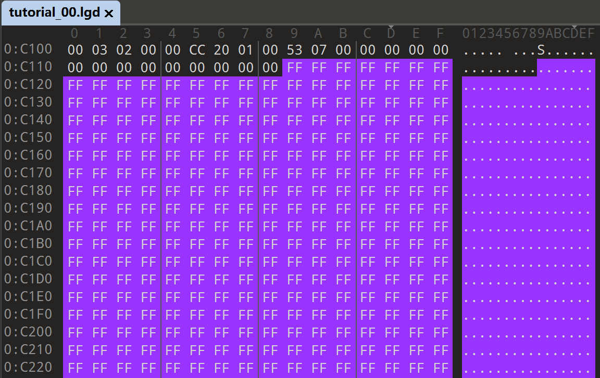
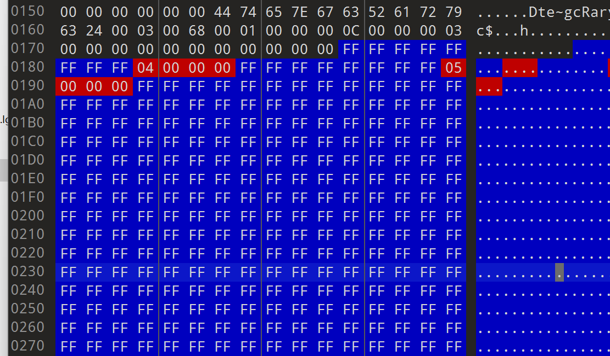
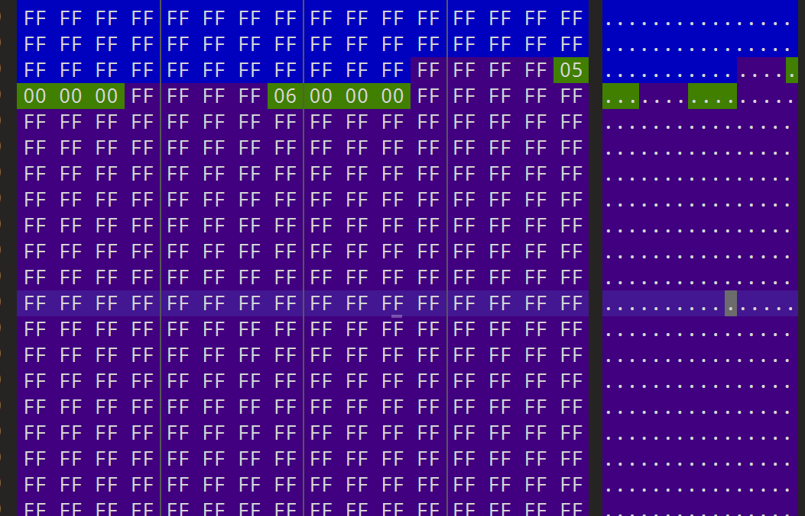

# LGD File Documentation

## Overview

The LGD compiler is an offline static compiler + static linker.

You can analogize the relationship between LGD and LGC to that of a Java file and a JVM-compiled `.class` file.

It was originally designed for early mobile game platforms. The purpose is to pre-compile readable C-like scripts (`.lgc`) into machine-executable binary bytecode (`.lgd`) in exchange for faster loading speeds and lower CPU overhead. Encryption is merely an incidental byproduct.

Suppose a level script `Level01.lgc` references 10 external scripts, such as `common.lgc`. If uncompiled, the engine would need to simultaneously initiate 10 file I/O operations for reading and parsing when loading the level, which is highly inefficient. However, after switching to the LGD compiler, all dependencies are packaged and linked into a single independent `.lgd` file. The engine only needs to handle a single I/O operation to complete the loading process, significantly improving execution efficiency.

Its compilation method mainly consists of three parts:

*   **Preprocessing:** Recursively processes `#include` directives in the source code. It "kneads" all referenced common scripts (such as `items.lgc`, `common.lgc`) into a final binary stream, much like linking C code.
*   **Syntax Checking:** Features complete syntax validation capabilities; if there is an error, it will directly report it.
*   **Map Binding Mechanism:** The compilation process uses a `.map` file as an index. It adopts a "one map, one script package" strategy.

>[!NOTE]
>
>The last version to use lgc was Alien Shooter The Beginning 1.1.3 IOS VER, released on November 22, 2013.
>
>

## Version and Usage Instructions

Currently, we have two versions of the compiler on hand (for which we must thank Sigma, who occasionally gifts you some developer tools). For convenience, let's call them the New Version and the Old Version. The main analysis in this article is based on the New Version.

+ Old version `lgd_generator.exe` compilation time: 2013-12-14 14:39:05
+ New version `lgc_compiler.exe` compilation time: 2017-10-31 08:36:40


There is no fundamental difference in how they run; the new version just adds a lot of weird functions, though there is a high probability you will never need them.

**Old Version Parameters**

| **Parameter** | **Description**                                              |
| ------------- | ------------------------------------------------------------ |
| `all`         | Compiles all lgc files in the current directory and all subdirectories, generating lgd files. |
| `[filename]`  | Generates an lgd only for the specified single lgc file.     |

**New Version Parameters**

| **Parameter**              | **Format**                   | **Logical Description**                                      |
| -------------------------- | ---------------------------- | ------------------------------------------------------------ |
| **1. Source Directory**    | `--source-dir=DIR`           | Specifies the root path to search for `.lgc` files. If not set, defaults to the current directory. |
| **2. Target Directory**    | `--target-dir=DIR`           | Specifies the storage location for the generated `.lgd` files. Retains the original directory structure. |
| **3. Macro Definition**    | `-D<DEFINE>`                 | Sets preprocessor macros (e.g., `-DPLATFORM_WIN=1`), used for conditional compilation inside the script. |
| **4. Include Path**        | `-I<PATH>`                   | Adds an `#include` search path. Supports overlapping multiple paths. |
| **5. Verbose Output**      | `-v` or `--verbose`          | Enables detailed log mode, displaying symbol processing details during compilation. |
| **6. Base Expansion Info** | `--base-expansion-info PATH` | Patch? Points to an existing expansion info file; if it does not exist, it will attempt to create one. |
| **7. Expansion File**      | `--expansion-file=PATH`      | Patch? Specifies the path to an expansion/patch file, triggering Checksum calculation logic. |
| **8. Version Number**      | `--version=VERSION`          | Specifies a version string for the patch, stored in `EXPANSION_VERSION`. |
| **9. Error Handling**      | `--stop-on-error`            | Stops immediately upon encountering the first compilation error, skipping subsequent files. |
| **10. Target Files**       | `FILES`                      | (Positional argument) Specifies one or more specific `.lgc` files to compile. |

One more thing: when using include in the old version, you must add the `maps/` path.

``` c++
#include "maps\export.lgc"
#include "maps\common.lgc"
#include "maps\common_compaign.lgc"
```

In the new version, you must **not** add the `maps/` path.

``` c++
#include "core\export.lgc"
#include "common.lgc"
#include "common_campaign.lgc"
```

## File Format

Before analyzing, let's just open a random file to look at its format, making subsequent analysis easier.

You can see:

The first part is very sparse, basically consisting of empty text.


The second part is relatively sparse, with a few garbled characters visible.


The third part is FF padding (strictly speaking, there are two parts here).



The fourth part is dense, where you can see a lot of `%` and other messy bytes.


## Part 1: Literal Table

It is primarily responsible for recording the statuses and initial values of all variables -- **(global variables, function parameters, local variables)**.

**The fixed first 4 bytes represent the index count.**

> [!TIP]
>
> 1. The engine's lowest level actually only supports `int`, `string`, and their corresponding arrays.
> 2. Although the engine reserves support for "pointer" operations in the underlying flags, they have never been actually used in official scripts.
> 3. There is no difference in the compiled file between `static` and non-`static` **global variables**; the difference between these two keywords only manifests when they are used as **local variables**.

### 1. Core Concept: The Difference Between Index and Global ID

To understand the Literal Table, you must first clarify the difference between `Index` (Entry Index) and `Global ID` (Logical Group ID). This is also the most confusing part of the entire table:

- **Index (Entry Index):** Represents a physical storage "slot". A basic variable takes up 1 Index; for an array of length $N$, each of its elements will occupy 1 independent Index. The `Entry Count` at the beginning of the file refers to the total number of Indexes.
- **Global ID (Logical Group ID):** Represents logical "ownership/affiliation". It is assigned in groups:
    - A standard variable exclusively occupies 1 ID.
    - **An entire array, regardless of how many elements it has, shares the same ID.**
    - **A function, along with all its internal parameters and local variables, also entirely shares the same ID.**

**👇 Experimental Comparison: Array Index vs. ID Allocation**

Let's take an `int` array with 3 elements as an example:

```c++
int intArray[3] = { 114, 514, 19198 };
```

In the Literal Table, it is split into 3 Index entries, but they share the same ID (for example, ID is `9`). Please observe the difference between the first array item and the subsequent items:

```c++
// [GlobalID: 9] Occupies 3 Index entries
// Flag | String(Empty) | Size or ID          | Value
   8E     00          03 00 00 00 /* Size: 3 */    72 00 00 00 /* Val: 114 */
   8E     00          09 00 00 00 /* ID: 9   */    02 02 00 00 /* Val: 514 */
   8E     00          09 00 00 00 /* ID: 9   */    FE 4A 00 00 /* Val: 19198 */
```

*Note: The first entry of the array records the length of the array (Size: 3), while the subsequent entries record the ID they belong to in the same position (ID: 9).*

------

### 2. Data Entry Structure and Flag Bits

Through the above analysis, we can summarize the standard memory structure for each Index entry as follows:

| **Offset (Byte)** | **Field Name**     | **Length**  | **Parsing Description**                                      |
| ----------------- | ------------------ | ----------- | ------------------------------------------------------------ |
| `0`               | **Flag**           | 1 byte      | Variable status/type flag (see table below for details).     |
| `1` ~ `n+1`       | **String Content** | n + 1 bytes | Variable name or string content, ending with `00`. If there is no string, it is just a single `00`. *(Note: Content is encrypted via XOR 17)* |
| `n+2` ~ `n+5`     | **ID / Size**      | 4 bytes     | **Core Distinguishing Field**: If it is an independent variable or the first item of an array, this records the **Size**; if it is a subsequent element of an array, this records the **ID**. |
| `n+6` ~ `n+9`     | **Value**          | 4 bytes     | The initial value for a signed integer. If it is a string type, this is usually padded with zeros as `00 00 00 00`. |

**Flag Bit (Byte 0) Composition Logic:**

The Flag value is actually formed by a bitwise OR combination of attributes with different weights:

| **Weight (Hex)** | **Function Category** | **Meaning Description**                                      |
| ---------------- | --------------------- | ------------------------------------------------------------ |
| `0x80`           | **Base Bit**          | Literal Entry (Mandatory identifier for Part 1 literal values) |
| `0x01`           | **Type Bit**          | Belongs to `String`                                          |
| `0x02`           | **Type Bit**          | Belongs to `Int` (Integer)                                   |
| `0x04`           | **Structure Bit**     | Belongs to `Array` (`[]`)                                    |
| `0x08`           | **Status Bit**        | Initialized (Assigned a value)                               |
| `0x20`           | **Pointer Bit**       | Pointer (`*`, unused in official scripts)                    |

Based on the weight combinations above, common Flag constants in decompilation are as follows:

- **Basic Unassigned:** `81` (unassigned string), `82` (unassigned int), `85` (unassigned string[]), `86` (unassigned int[])
- **Basic Assigned:** `89` (assigned string), `8A` (assigned int), `8D` (assigned string[]), `8E` (assigned int[])
- **Rare Pointer Types:** `A1` (string*), `A2` (int*), `A5` (string[]*), `A6` (int[]*)

------

### 3. Basic Variable Bytecode Parsing

To intuitively understand the structure of the Literal Table, let's set aside complex arrays for a moment and look at what the most basic `int` and `string` variables look like after compilation.

#### Case 1: Basic Int Variable

We define an unassigned `unusedValue` and a `gval` assigned the value of `166`:

```c++
int unusedValue;
int gval = 166;
```

The corresponding hexadecimal data in the Literal Table is as follows:

```c++
// [GlobalID: 0] Variable: int unusedValue;
// Flag | Str | Size(4 bytes)       | Value(4 bytes)
   82     00    01 00 00 00 /* Size: 1 */    00 00 00 00 /* Val: 0 */

// [GlobalID: 1] Variable: int gval = 166;
// Flag | Str | Size(4 bytes)       | Value(4 bytes)
   8A     00    01 00 00 00 /* Size: 1 */    A6 00 00 00 /* Val: 166 (0xA6) */
```

**Analysis:**

- **Flag:** `82` represents an unassigned int; `8A` represents an assigned int.
- **Str:** Because it's an integer variable, there is no string content here; it just uses `00` as a placeholder and ends.
- **Size:** This is a single variable, so the Size is fixed at 1 (`01 00 00 00`).
- **Value:** `unusedValue` is filled with 0 by default; `gval`'s 166 converted to hexadecimal is `A6 00 00 00`.

#### Case 2: Basic String Variable

String handling is similar to integers, but its "value" is written directly into the `Str` field (and has undergone simple XOR encryption), while the trailing `Value` field is forced to zero.

```c++
string unusedTxt; 
string txt = "sample text";
```

The corresponding hexadecimal data in the Literal Table is as follows:

```c++
// [GlobalID: 4] Variable: string unusedTxt;
// Flag | Str | Size(4 bytes)       | Value(4 bytes)
   81     00    01 00 00 00 /* Size: 1 */    00 00 00 00 /* Val: 0 */

// [GlobalID: 5] Variable: string txt = "sample text";
// Flag | Str (Encrypted String)                            | Size(4 bytes) | Value(4 bytes)
   89     64 76 7A 67 7B 72 37 63 72 6F 63 00 /* "sample text" */ 01 00 00 00 /* Size: 1 */ 00 00 00 00 /* Val: 0 */
```

**Analysis:**

- **Flag:** `81` represents an unassigned string; `89` represents an assigned string.
- **Str:** When unassigned, it is only `00`. When assigned `"sample text"`, the engine encrypts it via XOR 17 and stores it (hexadecimal `64 76...`), padding `00` at the end as the string terminator.
- **Value:** Since the data already exists in the preceding `Str` block, the subsequent Value field is uniformly padded with `00 00 00 00`.

---

### 4. Compiler "Special Quirks" and Experimental Verification

To thoroughly figure out the compiler's behavior, we tested macro definitions and local variables via scripts and discovered several interesting features.

#### Feature 1: Complete Erasure of Constants

Can't find macro definitions or constants in the table? That's because the compiler directly "discards" them during the preprocessing stage and replaces them with literal numeric values.

```c++
// Source code
#define USED_CONST 150
int constVal = USED_CONST;
```

```c++
// Compiled Literal Table: Handled directly as int constVal = 150;
// Flag | Str | Size                 | Value
   8A     00    01 00 00 00 /* Size: 1 */    96 00 00 00 /* Val: 150 */
```

#### Feature 2: Differentiated Handling of Local `Static` Variables (Extremely Bizarre Initialization)

The logic for handling `static` local variables inside functions is completely different, especially for arrays.

**If it is a `static` local variable:** It will directly retain its initialized value in the Literal Table.

```c++
static int stval = 100;
static int starr[] = {0x2222, 0x3333, 0x4444, 0x5555};
```

```c++
// Values are normally retained (64 00 00 00 is 100, 22 22 00 00 is 0x2222...)
   8A 00  01 00 00 00 /* Para 4 */   64 00 00 00 /* Val: 100 */
   8E 00  04 00 00 00 /* Para 5 */   22 22 00 00 /* Val: 8738 (0x2222) */
   // ...subsequent array elements normally carry their values
```

**If it is a non-`static` local variable:** The compiler will forcefully downgrade it to an **uninitialized variable**, and its initial values in the Literal Table are all filled with `0`. The actual assignment operation is deferred by the compiler to the later Bytecode execution stage!

```c++
int val = 100;
int arr[] = {0x2222, 0x3333, 0x4444, 0x5555};
```

```c++
// Flags become 82 (unassigned int) and 86 (unassigned int array), values are all 00 00 00 00!
   82 00  01 00 00 00 /* Para 9 */   00 00 00 00 /* Val: 0 */
   86 00  04 00 00 00 /* Para 10 */  00 00 00 00 /* Val: 0 */
   86 00  11 00 00 00 /* Para 11 */  00 00 00 00 /* Val: 0 */
   // ...all are 0
```

#### Feature 3: Parameter Mapping of Extern External Functions (Engine Interfaces)

The `extern` keyword is used to declare built-in functions provided by the engine's underlying layer. In the Literal Table, `extern` functions behave very similarly to normal functions: they are also assigned an independent **Global ID**, and their parameters are recorded.

``` c++
extern MessageText(string text,int x,int y,int fontNvid = -1) 114;
```

``` c++
// Extern: MessageText (Extern ID: 114)
    81 00                       01 00 00 00 /* Size: 1 */    00 00 00 00 /* Val: 0 */
    82 00                       01 00 00 00 /* Size: 1 */    00 00 00 00 /* Val: 0 */
    82 00                       01 00 00 00 /* Size: 1 */    00 00 00 00 /* Val: 0 */
    8A 00                       01 00 00 00 /* Size: 1 */    FF FF FF FF /* Val: -1 */
```

## Part 2: Symbol Table Structure Analysis

Immediately following the Literal Table is the **Symbol Table**. Its core function is to bind the "variable names" and "function names" defined in our source code to the `Global ID`s allocated in Part 1, and to record their metadata (such as entry offsets, parameter counts, etc.).

> **💡 Engine Trivia: Where did the local variables go?**
>
> In the Symbol Table, you will find that only **global variables** and **function names** exist. All function parameter names and local variable names are ruthlessly discarded by the compiler! From the perspective of the engine's underlying layer, local variables are nothing more than a bunch of unnamed stack offsets and `Index`es occupied in the Literal Table.

### 1. Overall Symbol Table Structure

The Symbol Table starts with a 4-byte count (Entry Count), indicating how many Global ID entries there are in total in the table.

Following that is the sequentially arranged entry data. Each entry consists of a **dynamically length string** + a **fixed 24-byte attribute block**:

- **Symbol Name (String):** A string encrypted via XOR 17, ending with `00`.
- **Attribute Block (24 bytes):** A binary structure of fixed length, specifically defined as in the table below.

| **Internal Offset (Byte)** | **Length** | **Field Name**          | **Detailed Meaning and Processing Logic**                    |
| -------------------------- | ---------- | ----------------------- | ------------------------------------------------------------ |
| `+0`                       | 2 bytes    | **Type**                | **Symbol type and status flag**. Distinguishes whether it is a variable, a regular function, or an Extern function (see the status table below for details). |
| `+2`                       | 2 bytes    | **Meta**                | **Multiplexed field**.<br />But in most cases, it is useless. |
| `+4`                       | 4 bytes    | **Extern ID / Padding** | **External function identifier**. <br />● **Extern Function (`Type=02`)**: Records its corresponding built-in ID. <br />● **Other cases**: Fixed padding of `00 00 00 00`. |
| `+8`                       | 4 bytes    | **P1_Idx**              | **Literal Table Index (Part 1 Index)**. Points to the starting position of this symbol's corresponding initial value in Part 1 (the Literal Table). |
| `+12`                      | 4 bytes    | **Size**                | **Size / Number of Elements**. <br />● **Variable**: The length of the array (e.g., 1 for `int a`, 3 for `int a[3]`). <br />● **Function**: The total length of the parameter list (**Note: Does NOT include local variables**). |
| `+16`                      | 4 bytes    | **File_ID**             | **Source File ID**. `0` represents the main file, `1, 2...` represent files `#include`d in order. (Note: The File ID for most functions is inaccurate, often all 0; the sorting logic for variables is currently untraceable). |
| `+20`                      | 4 bytes    | **Run_ID**              | **Runtime ID**. Specific purpose is unknown, randomly ordered. |

------

### 2. Type Flag and "Return Value Tracking" Mechanism

The `Type` field at offset `+0` of the Symbol Table is not just used to distinguish between variables and functions; it hides a highly ingenious mechanism: **The compiler statically analyzes whether the return value of a function is actually used in the context and records this in the Type.**

**Complete List of Type Flag Enumerations:**

- **`01 00`** : Global Variable
- **`02 00`** : External Function (Extern), and return value is **unused**
- **`02 01`** : External Function (Extern), and return value is **used**
- **`03 00`** : Regular Function (Function), no return value (Void)
- **`03 01`** : Regular Function (Function), has return value, and is used by the `await` keyword
- **`03 02`** : Regular Function (Function), has return value, but is **unused**
- **`03 03`** : Regular Function (Function), has return value, and is **used**

**👇 Experimental Comparison: Extern Return Value Tracking**

Taking the extern function `CreateSprite` as an example, different calling methods will directly change its `Type` signature in the Symbol Table:

```c++
// Scenario A: Just calling it, ignoring the return value
CreateSprite(1, 10, 20, 0); 
// Corresponding Type -> 02 00 

// Scenario B: Assigning the return value to a variable
int s = CreateSprite(1, 10, 20, 0); 
// Corresponding Type -> 02 01 
```

------

### 3. The True Meaning of Size: The Boundary Between Parameters and Locals

For variables, `Size` is very easy to understand (it's just the array length); but for functions, the `Size` field **only counts the number of function parameters, completely ignoring internal local variables**.

**👇 Experimental Comparison: Function Size Counting Logic**

We define the following code:

```c++
ScriptEvent4( int unit, int var1 = 114, string var2 = "text" ) {
    static int stval = 100;
    static int starr[] = {0x2222, 0x3333, 0x4444, 0x5555};
    int val = 100;
    int arr[] = {0x2222, 0x3333, 0x4444, 0x5555};
}

int afterFun[] = {2, 3, 4};
```

Analyzing the compiled Symbol Table entries:

**1. Function `ScriptEvent4`:**

```c++
// Encrypted Name: ScriptEvent4
   44 74 65 7E 67 63 52 61 72 79 63 23 00 
   03 00       // Type: Function (Void - no return value)
   C9 00       // Meta 
   00 00 00 00 // Padding: 0
   14 00 00 00 // P1_Index: 20
   03 00 00 00 // Size: 3 (Core verification point: Only counts the 3 parameters unit, var1, var2)
   00 00 00 00 // FileID: 0
   00 00 00 00 // RunID: 0
```

**2. Global Variable `afterFun`:**

```c++
// Encrypted Name: afterFun
   76 71 63 72 65 51 62 79 00 
   01 00       // Type: Variable
   CA 00       // Meta: Residual garbage data
   00 00 00 00 // Padding: 0
   21 00 00 00 // P1_Index: 33
   03 00 00 00 // Size: 3 (Array length is 3)
   00 00 00 00 // FileID: 0
   1A 00 00 00 // RunID: 26
```

As you can see, even though `ScriptEvent4` is internally stuffed with local variables like `stval`, `starr`, `val`, taking up a large amount of `P1_Index` space, the `Size` in the Symbol Table still displays as `03`. This confirms that the Symbol Table manages functions at the level of the "external calling signature" and doesn't care about their internal local state. However, we can still deduce the local variables inside a function by using the index difference between the adjacent upper and lower groups and combining it with P1.

## Part 3: Special Value Table (Action & ScriptEvent Table)

An area that defaults to being entirely padded with FF, used for ActionX and ScriptEventX, likely for quick positioning and map interaction.

The size and structure of this special value table are **absolutely fixed**, with a total size of **2048 Bytes**. The calculation formula is: `4 bytes (size of a single slot) × 256 (number of supported identifiers 0~255) × 2 (two groups: variables and functions)`.

If these variables or functions with special numbers are defined in the `.lgc` script, the compiler will "hollow out" the `FF FF FF FF` at the corresponding number in this area during compilation, and fill in their reference addresses.

Sample Code

``` c++
int arr[] = {1,2,3}; //id = 0 index = 0-3
int a = 114; //id = 1 index = 4

int Action2 = 100; //id = 2 index = 5
int Action5 = 200; //id = 3 index = 6

int arr2[] = {1,2,3}; //id = 4

ScriptEvent1( int val1, int val2, int val3 ){
    //id = 5
}

ScriptEvent3( int val1, int val2, int val3 ){
    //id = 6
}
```

#### Rule A: Special Variable `int ActionX`

- **Type Restriction**: Must be of `int` type.
- **Filled Content**: Records this variable's **P1_Index (Entry Index)** in the Literal Table (Part 1).
- **Example**: As shown in the code, if Action2/Action5 are defined, then the corresponding FF padding is hollowed out and filled with the index value.



#### Rule B: Special Function `ScriptEventX`

- **Mandatory Parameter Restriction**: Must contain **and only contain 3 parameters**, for example, `ScriptEvent5(int var1, int var2, int var3)`. If the number of parameters is incorrect, compilation will fail.
- **Filled Content**: Records this function's **Global ID** in the Literal Table.
- **Example**: As shown in the code, if ScriptEvent1/ScriptEvent3 are defined, then the corresponding FF padding is hollowed out and filled with the Global ID value.



## Part 4: Bytecode Segment and Instruction Set (Opcode Table)

The beginning of the code segment consists of a **4-byte integer**, representing the total length of the subsequent bytecode.

These first 4 bytes are in **plaintext** and unencrypted, but all bytecode data starting from the 5th byte is encrypted entirely via **XOR 0x25**.

### Instruction Set

#### 1. Value Types & Constants

| **Opcode** | **Mnemonic** | **Symbol** | **Description**                                | **Operands (Size & Type)**                    |
| ---------- | ------------ | ---------- | ---------------------------------------------- | --------------------------------------------- |
| `0x01`     | `PUSH_INT`   |            | Pushes an integer constant value to the stack. | **4 Bytes** (32-bit integer constant value)   |
| `0x02`     | `PUSH_STR`   |            | Pushes a string constant value to the stack.   | **Variable length** (String ending in `0x00`) |

------

#### 2. Unary Operators

*These operators act directly on the current data at the top of the stack, so the instructions themselves carry no operands (0 Bytes).*

| **Opcode** | **Mnemonic** | **Symbol** | **Description**    | **Operands**                  |
| ---------- | ------------ | ---------- | ------------------ | ----------------------------- |
| `0x03`     | `NEG`        | `-`        | Arithmetic negate. | **0 Bytes** (Relies on stack) |
| `0x04`     | `BIT_NOT`    | `~`        | Bitwise NOT.       | **0 Bytes** (Relies on stack) |
| `0x05`     | `LOG_NOT`    | `!`        | Logical NOT.       | **0 Bytes** (Relies on stack) |

------

#### 3. Arithmetic Operators

*Binary operators. They pop two values from the stack, perform the calculation, and push the result. The instruction itself has no operands.*

| **Opcode** | **Mnemonic** | **Symbol** | **Description**               | **Operands** |
| ---------- | ------------ | ---------- | ----------------------------- | ------------ |
| `0x06`     | `DIV`        | `/`        | Performs division.            | **0 Bytes**  |
| `0x07`     | `MOD`        | `%`        | Performs modulo operation.    | **0 Bytes**  |
| `0x08`     | `ADD`        | `+`        | Performs addition.            | **0 Bytes**  |
| `0x09`     | `SUB`        | `-`        | Performs subtraction.         | **0 Bytes**  |
| `0x0A`     | `BIT_XOR`    | `^`        | Performs bitwise XOR.         | **0 Bytes**  |
| `0x0B`     | `BIT_OR`     | `|`        | Performs bitwise OR.          | **0 Bytes**  |
| `0x0C`     | `BIT_AND`    | `&`        | Performs bitwise AND.         | **0 Bytes**  |
| `0x13`     | `MUL`        | `*`        | Performs multiplication.      | **0 Bytes**  |
| `0x16`     | `SHR`        | `>>`       | Performs bitwise right shift. | **0 Bytes**  |
| `0x17`     | `SHL`        | `<<`       | Performs bitwise left shift.  | **0 Bytes**  |

------

#### 4. Comparison Operators

*Compares the two values at the top of the stack and pushes the boolean result. No inline operands.*

| **Opcode** | **Mnemonic** | **Symbol** | **Description**                       | **Operands** |
| ---------- | ------------ | ---------- | ------------------------------------- | ------------ |
| `0x0D`     | `EQ`         | `==`       | Compares if equal.                    | **0 Bytes**  |
| `0x0F`     | `GT`         | `>`        | Compares if greater than.             | **0 Bytes**  |
| `0x10`     | `LT`         | `<`        | Compares if less than.                | **0 Bytes**  |
| `0x11`     | `GE`         | `>=`       | Compares if greater than or equal to. | **0 Bytes**  |
| `0x12`     | `LE`         | `<=`       | Compares if less than or equal to.    | **0 Bytes**  |
| `0x14`     | `NE`         | `!=`       | Compares if not equal.                | **0 Bytes**  |

------

#### 5. Logical Operators

*Logical calculation pops the final consolidated result to the stack. Instruction has no inline operands.*

| **Opcode** | **Mnemonic** | **Symbol** | **Description**                                              | **Operands** |
| ---------- | ------------ | ---------- | ------------------------------------------------------------ | ------------ |
| `0x0E`     | `LOG_OR`     | `||`       | Calculates logical OR (`c = a || b;`) and pushes result to stack. | **0 Bytes**  |
| `0x15`     | `LOG_AND`    | `&&`       | Calculates logical AND (`c = a && b;`) and pushes result to stack. | **0 Bytes**  |

------

#### 6. Flow Control & Structure

*Contains jump, function call, wait, and other mechanisms. Most carry a 4-byte address/offset or ID.*

| **Opcode** | **Mnemonic** | **Symbol** | **Description**                                              | **Operands (Size & Type)**                     |
| ---------- | ------------ | ---------- | ------------------------------------------------------------ | ---------------------------------------------- |
| `0x18`     | `JMP_FALSE`  |            | If the top stack value is false, jumps to specified address (used in if/while). | **4 Bytes** (Relative offset / Target address) |
| `0x19`     | `LINE_NUM`   | `;`        | Marks the end of a statement and records the current line number of source code. | **4 Bytes** (Code line number)                 |
| `0x1A`     | `ARG_COMMIT` | `()`       | Commits arguments to non-extern functions. Does not appear alone; always pairs with `CALL_FUNC`. | **0 Bytes**                                    |
| `0x1B`     | `AWAIT`      | `await`    | Suspends script execution (async wait). Has a semicolon but doesn't record line number. The operand represents the offset of the statement inside the parentheses. | **4 Bytes** (Offset)                           |
| `0x1C`     | `JMP`        |            | Unconditional jump to target address (used in else/goto/break). | **4 Bytes** (Relative offset / Target address) |
| `0x1D`     | `IFF`        | `iff`      | Executes special conditional check. Special format, followed by target addresses. | **8 Bytes** (Two 4-byte target addresses)      |
| `0x1E`     | `CALL_FUNC`  | `()`       | Executes a function.                                         | **4 Bytes** (Function ID or address)           |
| `0x1F`     | `RET`        | `return`   | Terminates the current function, returning control or return value. | **0 Bytes**                                    |
| `0x2C`     | `AND_JMP`    | `&&`       | Short-circuit logic: If left operand is false, jumps immediately to failure label, skipping calculation of right operand early. | **4 Bytes** (Relative offset)                  |
| `0x2D`     | `OR_JMP`     | `||`       | Short-circuit logic: If left operand is true, jumps immediately to success label, skipping calculation of right operand early. | **4 Bytes** (Relative offset)                  |

------

#### 7. Variables, Memory & Assignment

*Except for array accesses that use an index from the stack, operations on variables mostly require a 4-byte Variable ID / Address.*

| **Opcode** | **Mnemonic** | **Symbol** | **Description**                                              | **Operands (Size & Type)**                       |
| ---------- | ------------ | ---------- | ------------------------------------------------------------ | ------------------------------------------------ |
| `0x20`     | `POST_INC`   | `i++`      | Variable postfix increment.                                  | **4 Bytes** (Variable ID)                        |
| `0x21`     | `POST_DEC`   | `i--`      | Variable postfix decrement.                                  | **4 Bytes** (Variable ID)                        |
| `0x22`     | `PRE_INC`    | `++i`      | Variable prefix increment.                                   | **4 Bytes** (Variable ID)                        |
| `0x23`     | `PRE_DEC`    | `--i`      | Variable prefix decrement.                                   | **4 Bytes** (Variable ID)                        |
| `0x24`     | `PUSH_VAR`   |            | Pushes the value of a parameter or variable to the stack.    | **4 Bytes** (Variable ID)                        |
| `0x25`     | `ADDR_OF`    | `&`        | Gets the memory address of a variable.                       | **4 Bytes** (Variable ID)                        |
| `0x26`     | `ASSIGN`     | `=`        | Assigns the value at top of stack to specified variable.     | **4 Bytes** (Variable ID)                        |
| `0x27`     | `OP_ASSIGN`  |            | Compound assignment marker (specific operation decided by the immediate next byte, e.g., `+=`, `-=`). | **5 Bytes** (4-byte Variable ID + 1-byte opcode) |
| `0x28`     | `ARRAY_IDX`  | `[]`       | Accesses an array element using the index popped from the stack. | **0 Bytes** (Relies on index popped from stack)  |

------

#### 8. Type Casting

| **Opcode** | **Mnemonic** | **Symbol** | **Description**                                              | **Operands** |
| ---------- | ------------ | ---------- | ------------------------------------------------------------ | ------------ |
| `0x29`     | `CAST_STR`   | `(string)` | Converts current value at top of stack to string type.       | **0 Bytes**  |
| `0x2A`     | `CAST_INT`   | `(int)`    | Converts current value at top of stack to integer type.      | **0 Bytes**  |
| `0x2B`     | `CAST_SPR`   | `(sprite)` | [Removed] Converts current value at top of stack to a Sprite object. | **0 Bytes**  |

#### Call Mechanism

+ When the virtual machine needs to manipulate a variable (e.g., `PUSH_VAR`), it uses the variable's physical index **P1_Index** in Part 1.

+ When the virtual machine needs to call a function (e.g., `CALL_FUNC`), it uses the function's **Global ID** from the Symbol Table.

+ The engine can only call functions that have been defined prior to the call; it cannot call functions defined after it. If such a call occurs, the syntax checker will report an `Undeclared Identifier` error.

+ Every function always ends with a `RET`. They have no other meaning; they are engine placeholders used to mark the end of a function.

### IFF Structure

`iff` is followed by 4 + 4 operands. The first represents the address to jump to if it evaluates to false, and the second is the address where the evaluation condition starts (can be understood as the content inside the parentheses).

``` assembly
loc_0C1A:
  0C1A:  24 00 00 00 00     PUSH_VAR     g_int
  0C1F:  01 33 33 33 33     PUSH_INT     0x33333333
  0C24:  0F                 GT           
  0C25:  1D 1D 00 00 00 0E  IFF          loc_0C43, loc_0C1A  ; Iff Jump
        03 00 00
  0C2E:  24 00 00 00 00     PUSH_VAR     g_int
  0C33:  26 05 00 00 00     ASSIGN       sub_func_arg0
  0C38:  1A                 ARG_COMMIT   
  0C39:  1E 04 00 00 00     CALL_FUNC    sub_func
  0C3E:  19 4E 00 00 00     LINE_NUM     0x4E                ; Code Line 78
loc_0C43:
```

Corresponding source code:

``` c++
    iff (g_int > 0x33333333) {
        sub_func(g_int);
    }
```

### Extern Function Calls

If the Opcode is greater than `0x40` (decimal 64), it means this is not a built-in instruction, but an **Extern function call**. **Instructions `0x41 ~ 0xFF` (65~255)** will map directly to the corresponding `call_ext_XX` method.

>[!TIP]
>
>Trivia: The number of export functions in various engine versions is basically fixed, and they are generally identical.
>
>The range is from 65 to 255.
>
>I suspect they initially just allocated 1 byte of free space for them.
>
>What happens when they run out of space? They threw all the rest into `i_send_command.h`.

The way it uses parameters is also different from regular functions that rely on `ARG_COMMIT`. It just pushes all the required parameters in and then calls.

``` c++
CreateText(int font_vid,int x,int y,int z,string text,int behave=0)
{
  int sprite;
  sprite = CreateSprite(font_vid,x,y,z);
  Action(sprite,ACT_SET_TEXT,&text);
  Action(sprite,ACT_SET_BEHAVE,behave);
  return sprite;
}
```

For instance, in this example, `CreateSprite` has 5 parameters but only 3 were provided, so during the call, two additional parameters belonging to `CreateSprite` (where default values exist) will be pushed in to fill the space.

``` assembly
;Function CreateText() Begin
  C96A:  19 CD 03 00 00     LINE_NUM     0x3CD               ; Code Line 973
  C96F:  24 4B 01 00 00     PUSH_VAR     CreateText_arg0
  C974:  24 4C 01 00 00     PUSH_VAR     CreateText_arg1
  C979:  24 4D 01 00 00     PUSH_VAR     CreateText_arg2
  C97E:  24 4E 01 00 00     PUSH_VAR     CreateText_arg3
  C983:  24 05 00 00 00     PUSH_VAR     CreateSprite_arg4
  C988:  24 06 00 00 00     PUSH_VAR     CreateSprite_arg5
  C98D:  41                 CALL_EXT_65                      ; CreateSprite
  C98E:  26 51 01 00 00     ASSIGN       CreateText_local0
  C993:  19 CE 03 00 00     LINE_NUM     0x3CE               ; Code Line 974
; ...
  C9E1:  1F                 RET                              ; mark end of function
;Function CreateText() End
; ------------------------------------------------------------
```

### Local Non-static Variable Initialization

Remember what was mentioned at the beginning about non-static variable initialization?

Here comes the most bizarre/abstract part.

``` c++
ScriptEvent4( int unit, int var1 = 114, string var2 = "text" ){
static int stval = 100;
static int starr[]  = {0x2222, 0x3333, 0x4444, 0x5555};
int val = 100;
int arr[]  = {0x2222, 0x3333, 0x4444, 0x5555};
}

```
Non-arrays are okay, just a pretty normal push+assign.

``` assembly
  0B9D:  01 64 00 00 00     PUSH_INT     0x64
  0BA2:  26 1C 00 00 00     ASSIGN       ScriptEvent4_local5
  0BA7:  19 16 00 00 00     LINE_NUM     0x16                ; Code Line 22
  0BAC:  19 17 00 00 00     LINE_NUM     0x17                ; Code Line 23
```

Arrays... well, it's hard to judge. It treats each element in it as a separate int, assigns a value to it individually, and reassembles it when the assignments are done.

``` assembly
  0BB1:  01 22 22 00 00     PUSH_INT     0x2222
  0BB6:  26 1D 00 00 00     ASSIGN       ScriptEvent4_local6
  0BBB:  19 17 00 00 00     LINE_NUM     0x17                ; Code Line 23
  0BC0:  01 33 33 00 00     PUSH_INT     0x3333
  0BC5:  26 1E 00 00 00     ASSIGN       ScriptEvent4_local7
  0BCA:  19 17 00 00 00     LINE_NUM     0x17                ; Code Line 23
  0BCF:  01 44 44 00 00     PUSH_INT     0x4444
  0BD4:  26 1F 00 00 00     ASSIGN       ScriptEvent4_local8
  0BD9:  19 17 00 00 00     LINE_NUM     0x17                ; Code Line 23
  0BDE:  01 55 55 00 00     PUSH_INT     0x5555
  0BE3:  26 20 00 00 00     ASSIGN       ScriptEvent4_local9
  0BE8:  19 17 00 00 00     LINE_NUM     0x17                ; Code Line 23
```